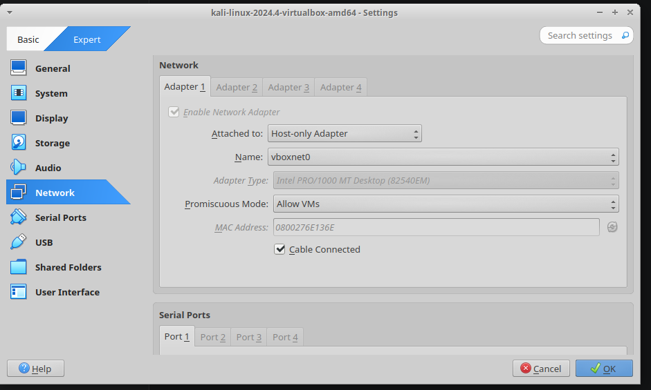
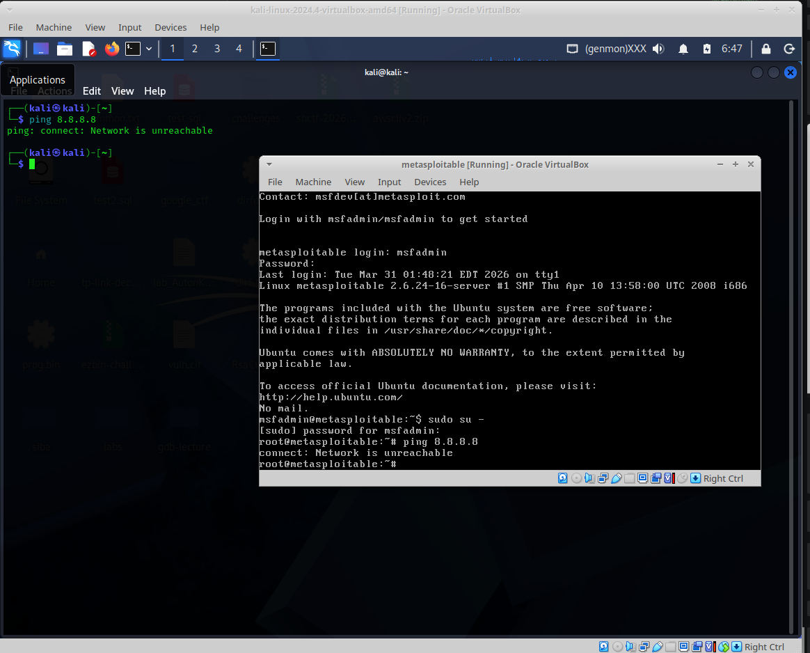
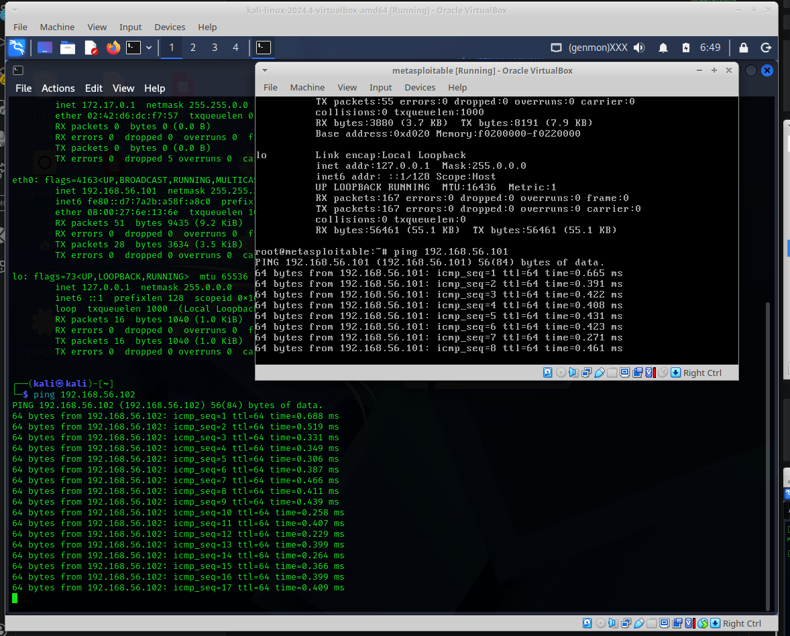
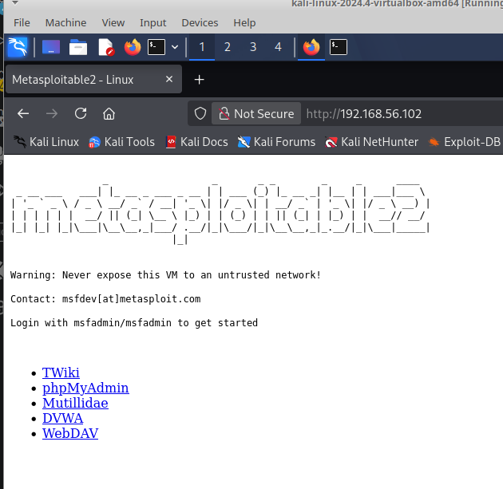
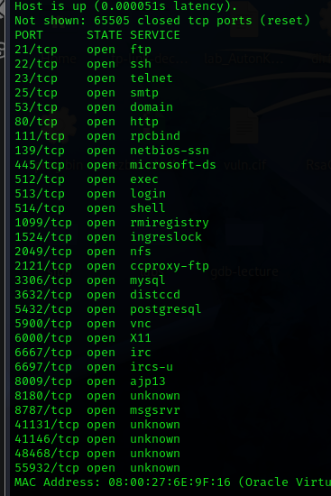

# h2 DORA the Explora
Can you say TIBER-FI?

>x) Lue/katso/kuuntele ja tiivistä. (Tässä x-alakohdassa ei tarvitse tehdä testejä tietokoneella, vain lukeminen tai kuunteleminen ja tiivistelmä riittää. Tiivistämiseen riittää muutama ranskalainen viiva. Lisää mukaan jokin oma havainto, idea tai kysymys)
>- Buuri 2026: DORA and TLPT testing - Lecture for Haaga-Helia on 31 March 2026 (pdf, 2 MB)

DORA (Digital Operations Resilience Act) on EU-Regulaatio EU:ssa toimiville pankeille, joka pakottaa testaamaan järjestelmien tietoturvaa.

TIBER-EU on EU:n tekemä viitekehys, joka sisältää parhaat käytännöt tietoturvat testaamiseen

Ennen tietoturvan testaaminen oli vapaaehtoista, vuodesta 2025 lähtien se on pakollista.

>- DORA (Regulation ... on digital operational resilience for the financial sector) (vain nämä kaksi artiklaa):
>- Article 26 "Advanced testing of ICT tools, systems and processes based on TLPT"
>- Article 27 "Requirements for testers for the carrying out of TLPT"
> TIBER-FI procedures and guidelines (pdf, 1 MB) (vain tämä kohta):
>- - 5.4 Testing phase: Red team testing (johdantokappale suoraan 5.4 alta, "5.4.1 Red team test plan creation" alkuun asti)

- Yrityksien pitää testata järjestelmien tietoturvallisuus (penetration testing) kerran kolmessa vuodessa. Tämä riippuu yrityksestä, (component authority) voi pakottaa yrityksen testaamaan järjestelmänsä useammin tai harvemmin.
- Testaus tulee tapahtua käytössä olevassa (production) ympäristössä.

>- Vapaaehtoinen bonus: Buuri 2026: D26 - Releasing Your Inner TIBER in Regulated Adversary Simulations. Video, 45 min. Disobey 2026.

>a) Asenna Metasploitable 2 virtuaalikoneeseen.

>b) Tee Kalin ja Metasploitablen välille virtuaaliverkko. Jos säätelet VirtualBoxista
>- Kali saa yhteyden Internettiin, mutta sen voi laittaa pois päältä
>- Kalin ja Metasploitablen välillä on host-only network, niin että porttiskannatessa ym. koneet on eristetty intenetistä, mutta ne saavat yhteyden toisiinsa

>c) Harjoittelemme omassa virtuaaliverkossa, jossa on Kali ja Metaspoitable.
>- Osoita testein, että:
>1) koneet eivät saa yhteyttä Internetiin

>2) Koneet saavat yhteyden toisiinsa.

>d) Etsi Metasploitable porttiskannaamalla (nmap -sn). Tarkista selaimella, että löysit oikean IP:n - Metasploitablen weppipalvelimen etusivulla lukee Metasploitable.

>e) Porttiskannaa Metasploitable huolellisesti ja kaikki portit (nmap -A -T4 -p-). Poimi 2-3 hyökkääjälle kiinnostavinta porttia. Analysoi ja selitä tulokset näiden porttien osalta. Voit hakea analyysin tueksi tietoa verkosta, muista merkitä lähteet.

>f) Vapaaehtoinen bonus: Sisään vaan. Pääsetkö murtautumaan Metasploitableen?

>g) Vapaaehtoinen bonus: jos haluat, voit jo kokeilla metasploit-hyökkäysohjelmaa omaan harjoitusmaaliisi. Tätä katsotaan myöhemmin yhdessäkin. (Muista irrottaa kone Internetistä kokeilujen ajaksi. 'sudo msfdb init', 'sudo msfconsole').