# h3 EternalHomework'

## tehtävät: https://terokarvinen.com/tunkeutumistestaus/#h3-eternalhomework

> x) Lue/katso/kuuntele ja tiivistä. (Tässä x-alakohdassa ei tarvitse tehdä testejä tietokoneella, vain lukeminen tai kuunteleminen ja tiivistelmä riittää. Tiivistämiseen riittää muutama ranskalainen viiva.)

>- € Jaswal 2020: Mastering Metasploit - 4ed: Chapter 1: Approaching a Penetration Test Using Metasploit (kohdasta Conducting a penetration test with Metasploit luvun loppuun eli "Summary" loppuun)

- Kirjan luvussa kerrottiin miten asennetaan metasploit ympäristö virtualboxiin.
- Kirjan luvussa kerrottin metasploitin hyödyistä: "open source, Support for testing large networks and natural naming conventions, Smart payload generation and switching mechanism, Cleaner exits"

>- Mitä 'nmap -sn' tekee? Älä arvaa, vaan perustele lähteillä. Mistä tiedät, että käyttämäsi lähde on luotettava?

nmap --help kertoo, että -sn tekee ping skannauksen. Ei tee siis porttiskannausta. Tällä voi katsoa, mitkä eri verkon laitteet vastaavat.

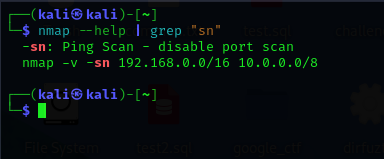

Lähde on luotettava, koska se on nmap:in oma help komento.

> b) Tallenna porttiskannauksen tuloksia Metasploitin tietokantoihin. Skannaa niin, että Metasploitable tulee mukaan. Kannattaa ottaa mukaan ainakin versioskannaus -sV (joka on banner grabbing plus).

Tunnilla käytiin läpi, että db_nmap komennolla voi tallentaa metaspoitin tietokantoihin.

Eli siis käynnistetään ensin tietokanta ja sen jälkeen metasploit: "sudo msfdb init && msfconsole"

Verkko on konfiguroitu niin, että metaspoitablen ja toisen virtuaalikoneen välillä on suljettu verkko.

Aloitaan niin, että varmistutaan siitä että kone ei saa yhteyttä internetiin.

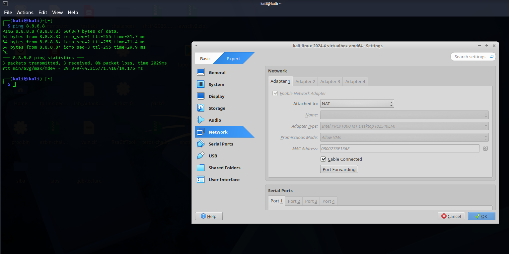

Onneksi testasin, hups olin unohtanut vanhat asetukset päälle.

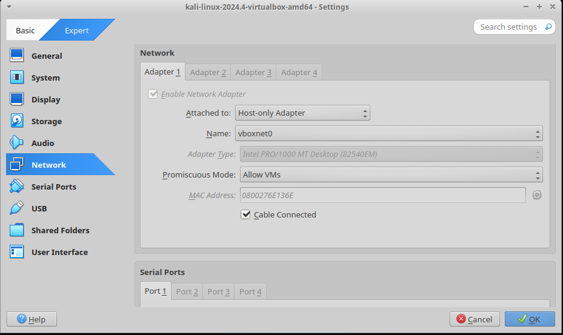

Noin, testataan vielä.

Ei toimi!

Sitten aloitetaan, eli ekana skannataan koko netti.

Selvitetään ensin subnet mask

inet 192.168.56.101/24

kalin osoite: 192.168.56.101
verkon osoite: 192.168.56.0
mask: 255.255.255.0

Odotetut tulokset:
kali linux virtuaalikone
metasploitable
virtualboxin dhcp server (viime tunnilla käytiin läpi, että voi löytyä tälläinen)

Eli siis tunnilla käytiin läpi, että nmap ja db_nmap sama asia, mutta db_nmap tallentaa metasploit kantaan. Ja siis jos komennon unohtaa, aina voi käyttää help komentoa.

db_nmap -sn 192.168.56.0/24

Nyt löytyikin 4 laitetta:
192.168.56.1 ??
192.168.56.100 virtualbox dhcp server
192.168.56.101 kali virtuaalikone
192.168.56.102 metasploitable

Dhcp server:

kali:

metasploitable:

Mysteerilaite löytyi, se oli network adapterin oma osoite:

Tämän takia oli 4 laitetta netissä.

tehdään vielä sama uusiksi mutta tällä -sV flagilla:

> c) Tarkastele Metasploitin tietokantoihin tallennettuja tietoja komennoilla "hosts" ja "services". Kokeile suodattaa näitä listoja tai hakea niistä.

Siellä on kaikki 4 laitetta tallennnettuna:

hosts --help

-S, --search <filter>                  Search string to filter by

haetaan vaikka käyttöjärjestelmän nimellä:

services --help

Eli siis voidaan suodattaa portin, protokollan, ip osoitteen, info stringin ja sen mukaan onko host tällähetkellä ylhäällä

Suodatetaan vaikkapa nimen mukaan:

2 porttia auki jossa http protokolla.

> d) Internet famous. Etsi Metasploitablen mukana tulevista hyökkäyksistä (en: exploits; search) sellainen, joka on ollut julkisuudessa.

metasploitablessa voi etsiä komennolla "search" haavoittuvuuksia. Komennolle pitää vielä ilmoittaa hakusana perään. (https://medium.com/quiknapp/how-to-load-and-use-exploit-in-metasploit-61b4f10ceb9d, viitattu 14.7.2026)

Itselleni tuli ensimmäisenä mieleen polkit exploit, joka siis oli iso juttu vuonna 2021. google kertoo, että: "A local user can use this flaw to gain root privileges on a compromised system to run specially crafted code." (https://docs.cloud.google.com/security-command-center/docs/findings/threats/polkit-local-privilege-escalation-vulnerability, viitattu 14.7.) Muistelen, että haavottuvuus on ollut vuosia linuxissa, sitä vaan ei löydetty kuin vasta 2021.

lisää tietoa: https://www.exploit-db.com/exploits/50011

Tarkistetaanpas löytyykö:

On se siellä.

> e) Vertaile nmap:n omaa tiedostoon tallennusta (-oA foo) ja db_nmap:n tallennusta tietokantoihin. Mitkä ovat eri tiedostomuotojen ja Metasploitin tietokannan hyvät puolet?

db_nmap tallentaa metasploitin tietokantaan ja metasploitilla voi suodattaa myös tietoja jne.

Joka ei ole niin helppoa tiedostoon tallentamisessa.

> f) Murtaudu Metasploitablen vsftpd-palveluun

Tässä vaiheessa tajusin, että olen käyttänyt vanhaa workspacea. Tein siis uuden workspacen itselleni. Skannasin myös metasploitablen uudelleen:

Hyvä, että aiemmat tulokset pysyvät muistissa. Mutta tein nyt uuden, koska halusin poistaa kaiken edellisen.

Tarkistetaan haavoittuvuudet sftpd:ssä. Nämä ovat kyllä todella vanhoja. Olisi hyvä jos metasploitablen tietokantaa voisi päivittää tai vaihtoehtoisesti ladata netistä CVE hyökkäysskriptejä.

(ehkä kukaan ei enää käytä sftpd:tä? tai sitten metasploitin hakua ei ole vaan päivitetty... En tiedä)

Valitaan haavoittuvuus aktiiviseksi:

Tässä komentoja, joita voi käyttää:

Kokeillaan!

RHOSTS puuttuu. Eli siis se on se mihin koneeseen hyökätään.

Testataan vielä että ollaan oikeasti IN:

metasploitable sammu kokonaan:

> g) Kerää levittäytymisessä (lateral movement) tarvittavaa tietoa metasploitablesta. Analysoi tiedot. Selitä, miten niitä voisi hyödyntää.

Tekoäly chatgpt:n mukaan levittäytymisessä tarvittavat tiedot ovat esimerkiksi käynnissä olevat palvelut.

Tutkitaan tätä, nmappasin koneen aiemmin joten katsoin vaan tietokannasta:

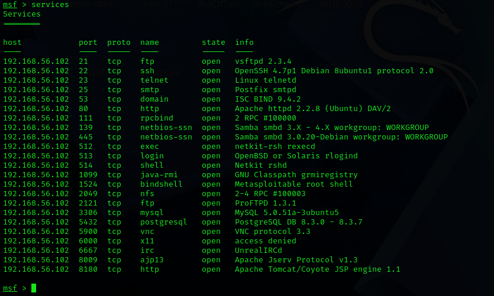

tästä voisi vaikkapa katsoa versionumeroita ja varmistaa vielä jotenkin toisella tavalla että versio pitää oikeasti paikkaansa. Tietokantaan on mahdollista antaa kommentti esim. toimii, ei toimi, ei ole testattu jne. Siinä voi lukea ihan mitä vaan.

Version perusteella voi sitten katsoa vaikkapa exploit db:stä haavoittuvuudet tai sitten vaikka ihan metasploitista. Mulla jotenkin ei löydy uusimmat (en tiedä miksi) niin pitää kyllä katsoa netistä sitten.

Haavoittuvuus voi olla myös huono salasana tms. Esim. vastaamo casessa oli laitettu mysql oletussalasana.

> h) Murtaudu Metasploitableen jollain toisella tavalla. (Jos tämä kohta on vaikea, voit tarvittaessa turvautua verkosta löytyviin läpikävelyohjeisiin. Merkitse silloin raporttiin, missä määrin tarvitsit niitä).

Ei toiminut vaikka yritin kahta eri exploittia

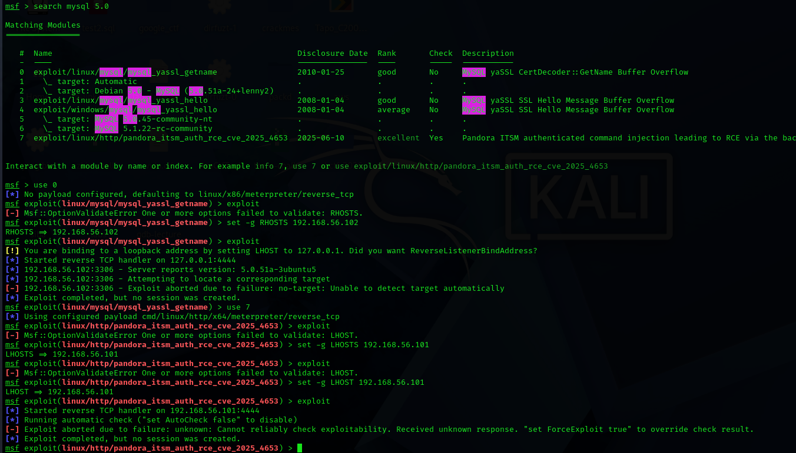

Yritin salasanacräckkiä mutta ei vaan onnistu:

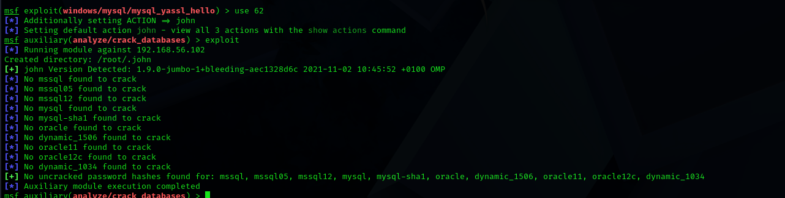

Sitten ajattelin että katson netistä!

"mysql 5.0 51a 3ubuntu5 login without password"

Google geminin vastaus:

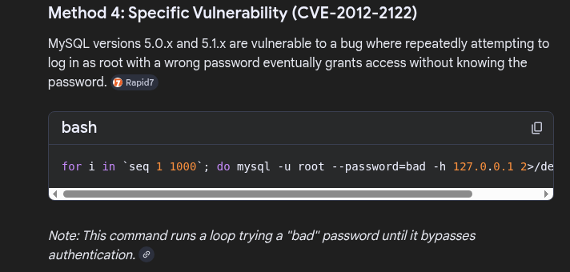

Nettisivuilla oli lisää tietoa: https://www.rapid7.com/blog/post/2012/06/11/cve-2012-2122-a-tragically-comedic-security-flaw-in-mysql/

Eli siis: "In short, if you try to authenticate to a MySQL server affected by this flaw, there is a chance it will accept your password even if the wrong one was supplied. The following one-liner in bash will provide access to an affected MySQL server as the root user account, without actually knowing the password."

for i in `seq 1 1000`; do mysql -u root --password=bad -h 127.0.0.1 2>/dev/null; done

--> ei toiminut

Piti vielä lisätä se --skip-ssl siihen.

Ei toiminut silti. Ajattelin vielä kokeilla ilman salasanaa jos pääsisi sisään mysql

Onnistui!

Käytin tähän monta tuntia aikaa, olikin näin helppo.

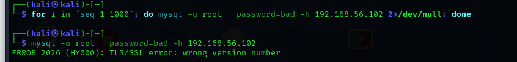

Luulen että script ei toiminut, koska salasanaa ei ollut määritelty. Luulisin että script oletti että salasana on määritelty.

Otin opiksi että kannattaa kokeilla yksinkertaiset jutut ensin esim. huono salasana tai ei salasanaa ollenkaan. Ei hakkerointi aina ole niin monimutkainen prosessi, mutta pitää muistaa että tämä on metasploitable. Sama kuin vastaamo casessa, eli ei oltu suojattu tietokantaa kauheen hyvin.

Olisi ollut kuitenkin mielenkiintoista tietää olisiko haavoittuvuus toiminut jos salasana olisi määritelty.

> i) Demonstroi Meterpretrin ominaisuuksia.

En ole ihan varma onko tämä meterpreter missä olen nyt vai onko tämä Meta shell.

Laitoin meterpreteriin komennon help:

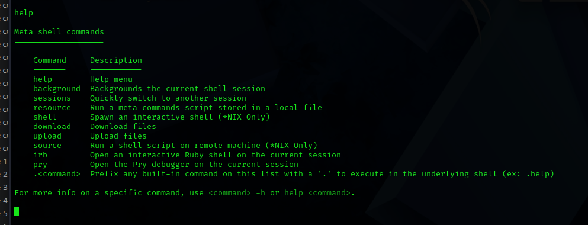

Eli siis meterpreterissä voi ajaa bash komentoja tai sitten voi ajaa näitä meterpreterin omia komenotoja

pystyn esim. lataamaan ja lähettämään tiedostoja, ajamaan bash scriptin ja laittamaan meterpreterin taustalle (hyödyllistä jos on hyökännyt moneen tietokoneeseen)

> j) Tallenna shell-sessio tekstitiedostoon script-työkalulla (script -fa log001.txt) tai tmux:lla.

Laitoin meterpreteriin komennon script jne ja sen jälkeen sain mahdollisuuden tallentaa komentoja.

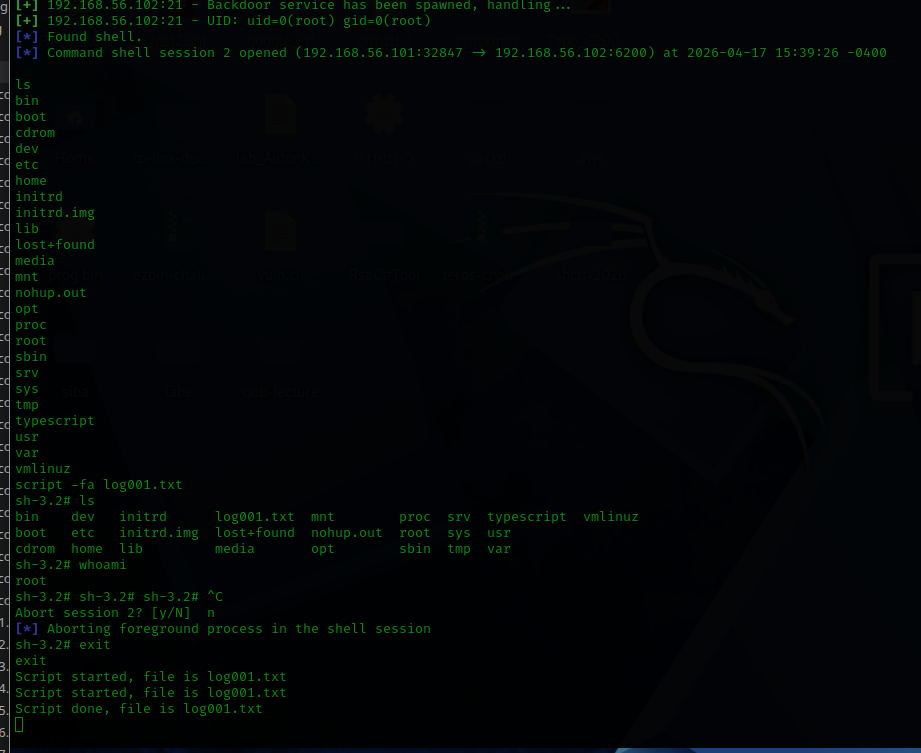
> k) Pivot point. Laita kaikki harjoituksen tiedostot (script -fa, nmap -oA...) samaan kansioon. Hae sopiva pivot point (sovellus, versio, osoite, MAC-numero) 'grep -r' -komennolla. Keksi uskottava esimerkkikysymys, johon haet vastausta.

En oikein ymmärtänyt miksi kaikki pitää laittaa samaan kansioon. Metasploitissa on hyvä tietokanta josta voi etsiä tietoa.

pivot point kysymys voisi olla esim. että:
- sisäverkon skannaus nmap komennolla (ei hyödyllistä, koska kali ja metasploitable samassa sisäverkossa)
- mitä käyttäjiä metasploitablessa on
- mitä ohjelmia metasploitablessa on

> l) Attaaack! Mitä Mitre Attack taktiikoita ja tekniikoita käytit tässä harjoituksessa? (Tässä alakohdassa "Attaack!" ei tarvitse tehdä lisää testejä koneella, koska testit on jo tehty.)

Mitre attack tarkoittaa geminin mukaan tätä:
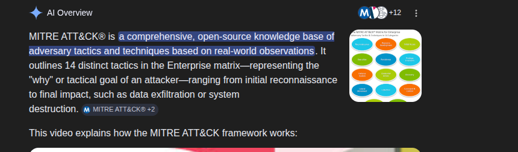

mitren sivustolla kerrotaan eri taktiikoista: https://attack.mitre.org/tactics/enterprise/

Esimerkiksi näitä taktiikoita käytettiin tässä harjoituksessa:

TA0043	Reconnaissance	The adversary is trying to gather information they can use to plan future operations.

TA0001	Initial Access	The adversary is trying to get into your network. --> no siis oltiin muutenkin samassa sisäverkossa, niin en ole varma tästä

TA0002	Execution	The adversary is trying to run malicious code.
--> bindattu shell on osittain malicious code

TA0004	Privilege Escalation	The adversary is trying to gain higher-level permissions. --> päästiin rootiks

TA0040	Impact	The adversary is trying to manipulate, interrupt, or destroy your systems and data. --> sammutettiin kone poweroff komennolla aiemmin

> m) Vapaaehtoinen: Etsi esimerkki Mitre Attack proseduurista (procedure), jossa joku uhkatoimija on käyttänyt samoja tekniikoita.

> n) Vapaaehtoinen: Titityy. Saatko Metasploitableen tty-shellin, eli esimerkiksi avattua koko ruudulle piirtävän nano:n?

> o) Vapaaehtoinen, vaikea: Kokeile jotain kilpailevaa hyökkäystyökalua tai vihamielistä etäkäyttötyökalua, kuten Sliver tai Scarecrow.

> p) Vapaaehtoinen: Asenna ja korkkaa Metasploitable 3. Karvinen 2018: Install Metasploitable 3 – Vulnerable Target Computer

> q) Vapaaehtoinen: Peekaboo. Demonstroi, kuinka hyökkääjä vakoilee meterpreterillä. Kuuntele mikrofonilla, ota kuvia tai videota kameralla. (Huolehdi, ettei ulkopuolisia joudu kuunnelluksi tai katselluksi.)