# h4 Täysin Laillinen Sertifikaatti
## tehtävät: https://terokarvinen.com/tunkeutumistestaus/#h4-taysin-laillinen-sertifikaatti

>x) Lue/katso ja tiivistä. (Tässä x-alakohdassa ei tarvitse tehdä testejä tietokoneella, vain lukeminen tai kuunteleminen ja tiivistelmä riittää. Tiivistämiseen riittää muutama ranskalainen viiva kustakin artikkelista - ei pitkiä esseitä. Kannattaa lisätä myös jokin oma ajatus, idea, huomio tai kysymys.)
>- OWASP 2021: OWASP Top 10:2021 https://owasp.org/Top10/A01_2021-Broken_Access_Control/ (IDOR ja path traversal ovat osa tätä)

- Rikkinäinen pääsynhallinta on yleisin haavoittuvuus
- pääsynhallinta pitää huolen, ettei käyttäjä voi tehdä asioita johon hänellä ei ole oikeuksia
- Pääsynhallintaa voi ohittaa esimerkiksi menemällä osoitteeseen esim. /admin-page tms. ja voi olla mahdollista että palvelin tarkistaa vain, että käyttäjä on kirjautunut sisään.

>- PortSwigget Academy:
>- - Insecure direct object references (IDOR)
- IDOR on pääsynhallinnan haavoittuvuus, jossa sovellus ei tarkista käyttäjän oikeuksia tai tarkistaa vain että on kirjautunut sisään
- Esimerkiksi huonosti suojatussa pankissa käyttäjä voisi katsoa kuinka paljon jollakin toisella on pankkitilillä rahaa.

>- - Path traversal
- Path travelsal on haavoittuvuus, jossa käyttäjä pääsee lukemaan muita palvelime tiedostoja esim. jos url on vaikka että mikä kuva haetaan niin käyttäjä voi laittaa get requestiin ?photo=../../../etc/passwd

>- - Cross-site scripting
- Ajatellaan, että on keskustelupalsta. Joku voi kommentoida:
"\

Käyttäjät, jotka menevät palstalle sivu avaa ikkunan "xss". Jos tämä toimii, hyökkääjä voi tehdä kaikkea muutakin javascriptillä esim. cookiea varastajan tms.

>a) Totally Legit Sertificate. Asenna OWASP ZAP, generoi CA-sertifikaatti ja asenna se selaimeesi. Laita ZAP proxyksi selaimeesi. Laita ZAP sieppaamaan myös kuvat, niitä tarvitaan tämän kerran kotitehtävissä. Osoita, että hakupyynnöt ilmestyvät ZAP:n käyttöliittymään. (Voi vaatia Firefox about:config network.proxy.allow_hijacking_localhost. Foxyproxy laittoi tämän aiemmin päälle itse. Kalin Firefox ESR oli viimeksi ongelmia Foxyproxyn kanssa - vaihtoehtona on asettaa Proxy käsin Settings, hakusana "proxy")

Latasin https://www.zaproxy.org/download/ osoitteesta "linux package"

sen jälkeen purin paketin, menin kansioon ja käynnistin ohjelman:

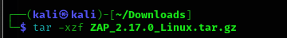

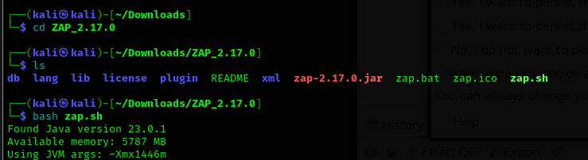

Laitoin tähän: "no, i dont want to ..."

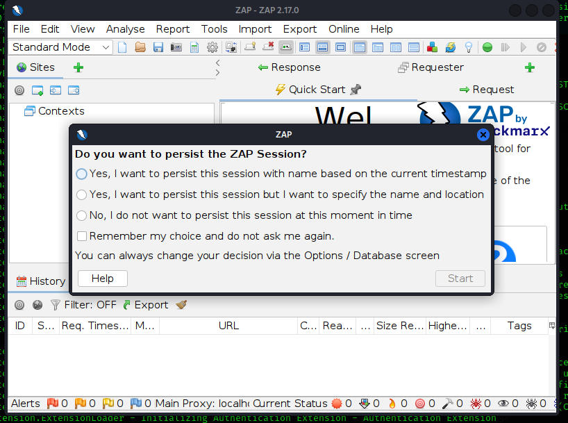

Katsoin netistä miten tästä eteenpäin: https://www.youtube.com/watch?v=louvjRFUs2o

Eli siis valitaan manual explore:

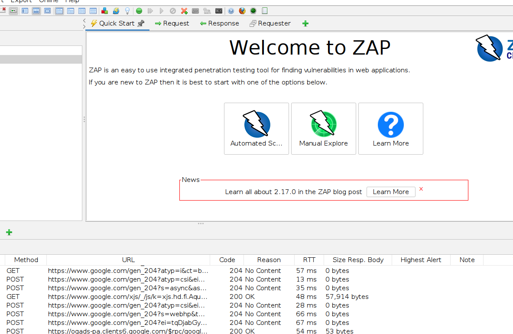

Kirjoitetaan URL to explore kohtaan google.com ja valitaan selaimeksi firefox:

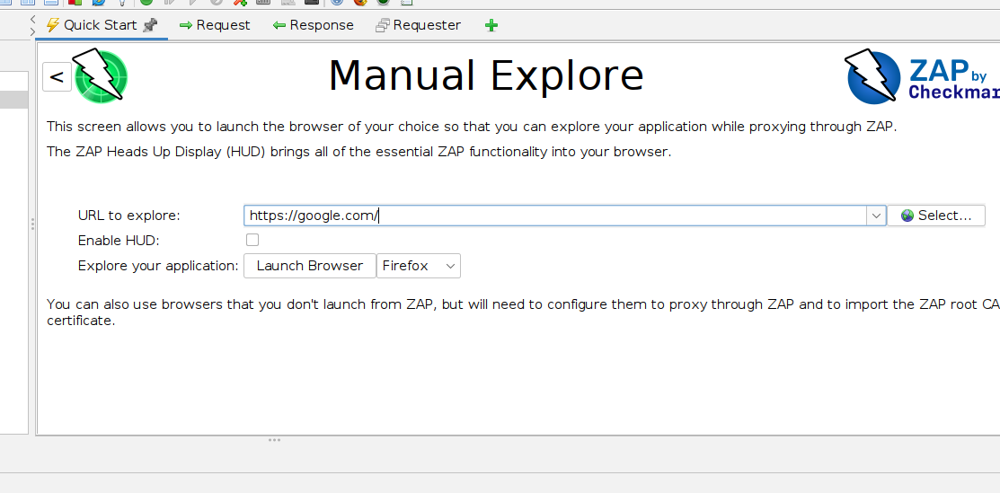

Ja sen jälkeen "launch browser". Tämä avaa firefoxin.

Toimii!:

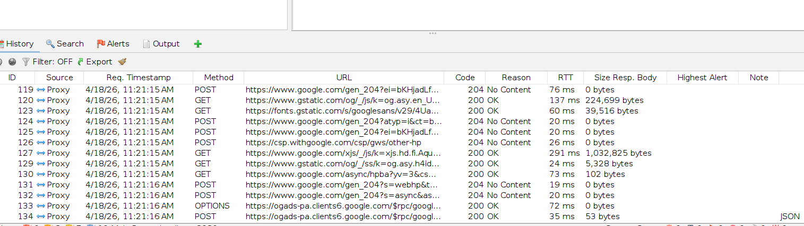

>b) Kettumaista. Asenna "FoxyProxy Standard" Firefox Addon, ja lisää ZAP proxyksi siihen. Käytä FoxyProxyn "Patterns" -toimintoa, niin että vain valitsemasi weppisivut ohjataan Proxyyn. (Läksyssä ohjataan varmaankin PortSwigger Labs ja localhost.)

Asennetaan:
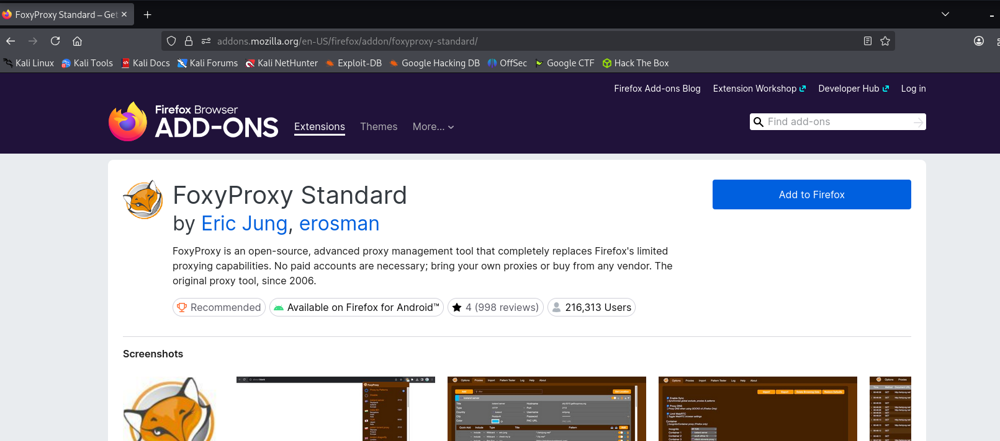

Ihmettelen miksi ei tullut näkyviin:

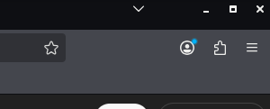

Oletan, että foxyproxyn pitäisi tulla tohon extensions kohtaan jotta pystyisin muokkaamaan asetuksia.

Luovutan tämän osalta. Liian vaikeaa... :(

>PortSwigger Labs. Ratkaise tehtävät. Selitä ratkaisusi: mitä palvelimella tapahtuu, mitä eri osat tekevät, miten hyökkäys löytyi, mistä vika johtuu. Kannattaa käyttää ZAPia, vaikka malliratkaisut käyttävät harjoitusten tekijän maksullista ohjelmaa. Monet tehtävät voi ratkaista myös pelkällä selaimella. Malliratkaisun kopioiminen ZAP:n tai selaimeen ei ole vastaus tehtävään, vaan ratkaisu ja haavoittuvuuden etsiminen on selitettävä ja perusteltava.
>- Cross Site Scripting (XSS)
>- - c) Reflected XSS into HTML context with nothing encoded
https://portswigger.net/web-security/cross-site-scripting/reflected/lab-html-context-nothing-encoded
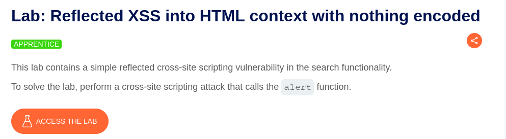

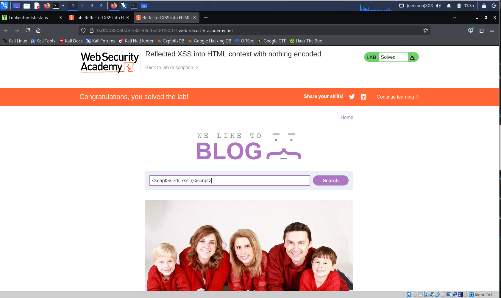

Eli siis testasin, voiko tämä toimia:

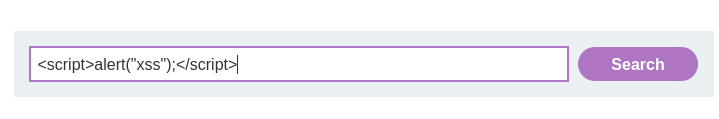

Ja se toimi!

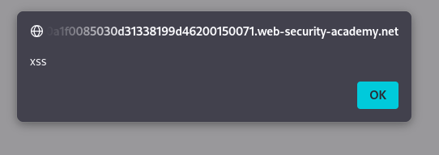

>- - d) Stored XSS into HTML context with nothing encoded
https://portswigger.net/web-security/cross-site-scripting/stored/lab-html-context-nothing-encoded
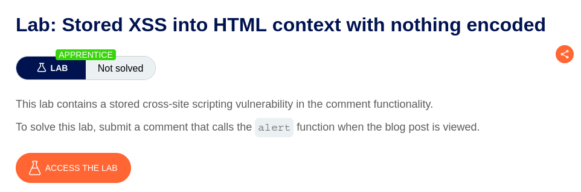

Otin vaan jonkun blog postauksen esim. tää eka on hyvä painoin view post:

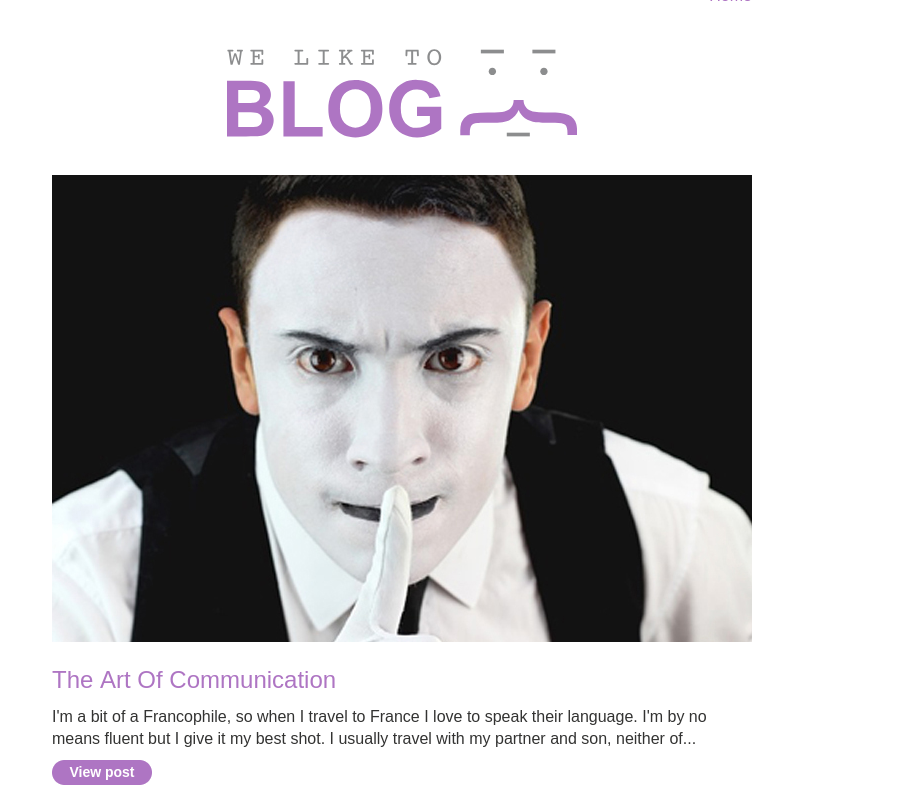

Jätetäänpäs kommentti:

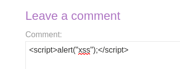

ja sen jälkeen reloadasin sivun toimi!

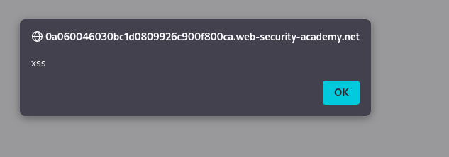

>- - e) Selitä esimerkin avulla, mitä hyökkääjä hyötyy XSS-hyökkäyksestä. Alert("Hei Tero!") ei vielä tarjoa kummoista pääsyä. (Tässä alakohdassa ei tarvitse tehdä testejä tietokoneella, pelkkä lyhyt ja selkeä selitys riittää.)

Hyökkääjä voi varastaa muiden evästeet, jolloin hän pääsee muiden käyttäjille. Hyökkääjä voi periaatteessa tehdä mitä tahansa. Voi vaikkapa vaihtaa kaikki kuvat tai linkit nettisivulta erilaisiksi.

Eli siis hyökkääjän skripti ajetaan kun käyttäjä menee nettisivulle.

>- Path traversal
>- - f) File path traversal, simple case. Laita tarvittaessa Zapissa kuvien sieppaus päälle.
https://portswigger.net/web-security/file-path-traversal/lab-simple

Valitsin open image in new tab:

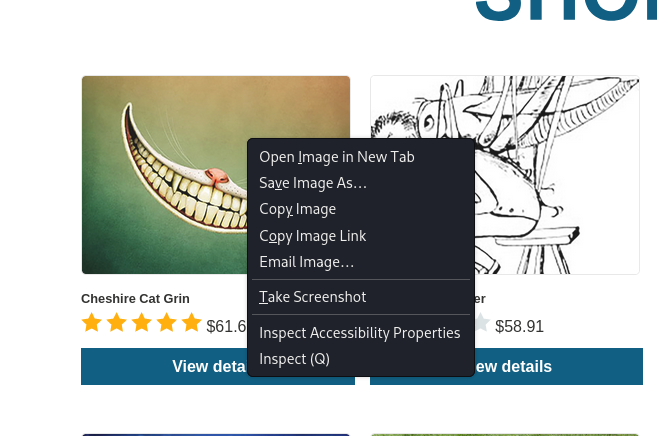

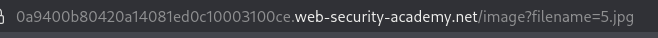

Testataan vähän! Oletan, että kuva on tiedostossa /var/www/html:

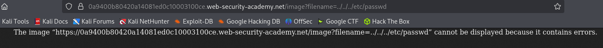

Jotain erroria sisältää, tämän kanssa pähkäilin vähän aikaa miksi tiedosto ei avaudu...

Menin takaisin edelliselle sivulle, ilmeisesti tämä oli se ratkaisu:

Testasin vielä hakea toisen tiedoston:

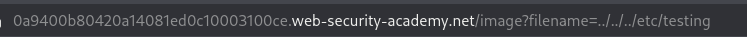

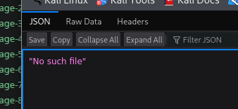

Epäilen, että ongelma oli siinä että yritetään näyttää kuvaa mutta passwd on tekstitiedosto joten se ei aukea. Tästä voisi vaikka sivulta etsiä jonkun txt tiedoston avaajan jos sitä kautta saisi sitten passwd tiedoston auki

Tai siis... Ongelmana oli firefox selain! Kokeilin vielä bashin kautta:

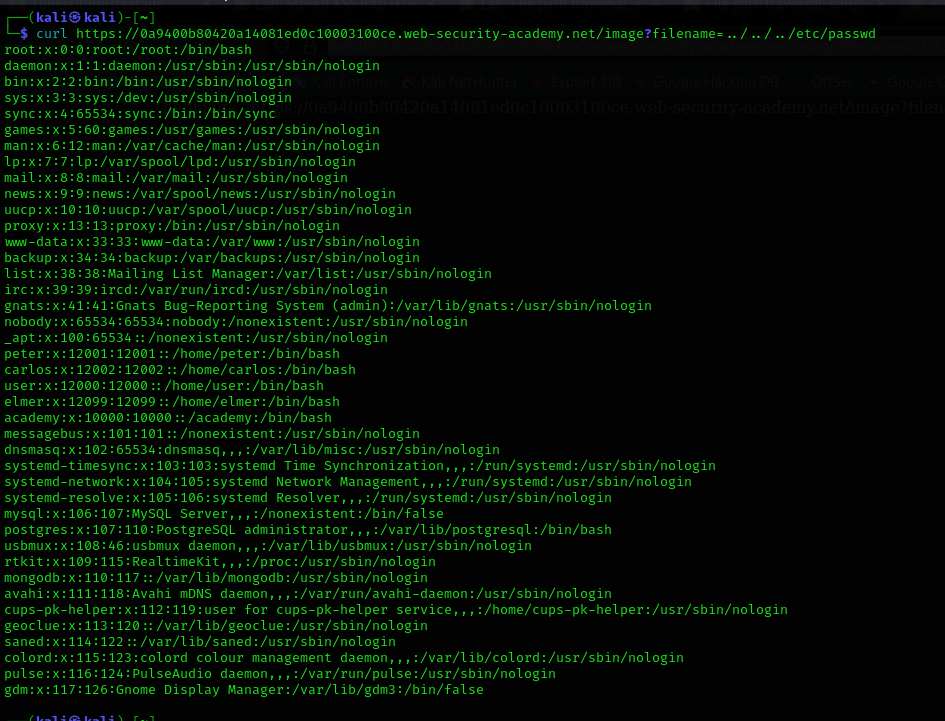

>- - g) File path traversal, traversal sequences blocked with absolute path bypass
https://portswigger.net/web-security/file-path-traversal/lab-absolute-path-bypass
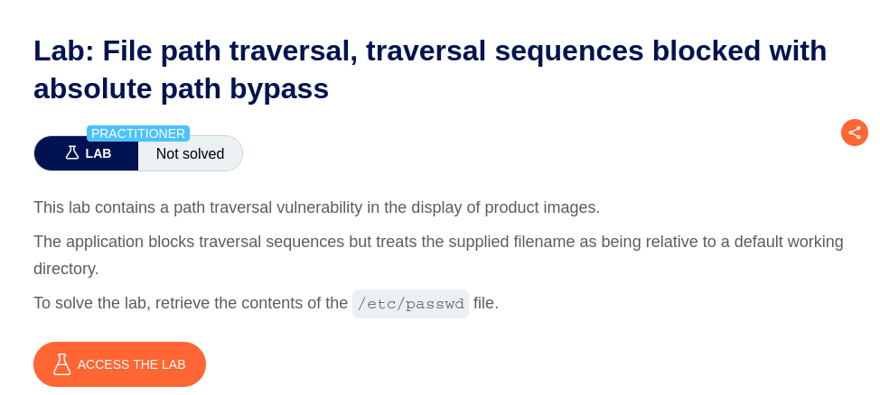

Piti ensin kokeilla tätä muttei se toiminut:

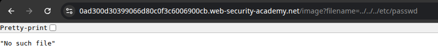

Entä jos menen vaan suoraan:

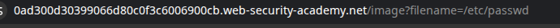

Katsotaan miltä sivu näyttää:

Rikkinäinen kuva, hmm...

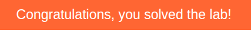

Jes! Ratkaistu!

Sitten vaan curl käyttöön!

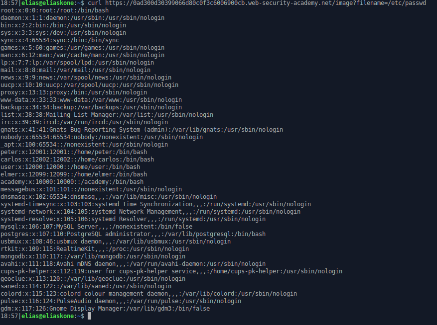

>- - h) File path traversal, traversal sequences stripped non-recursively
https://portswigger.net/web-security/file-path-traversal/lab-sequences-stripped-non-recursively
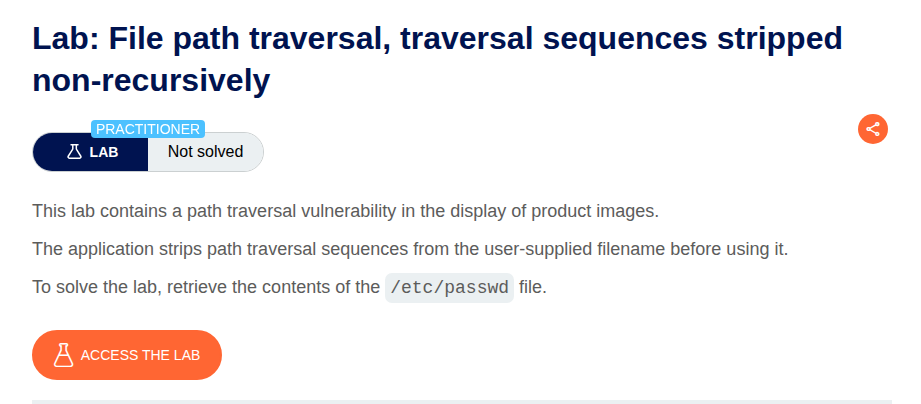

Tätä en saanut ratkaistua. :(

Katsoin ratkaisun youtube videosta:

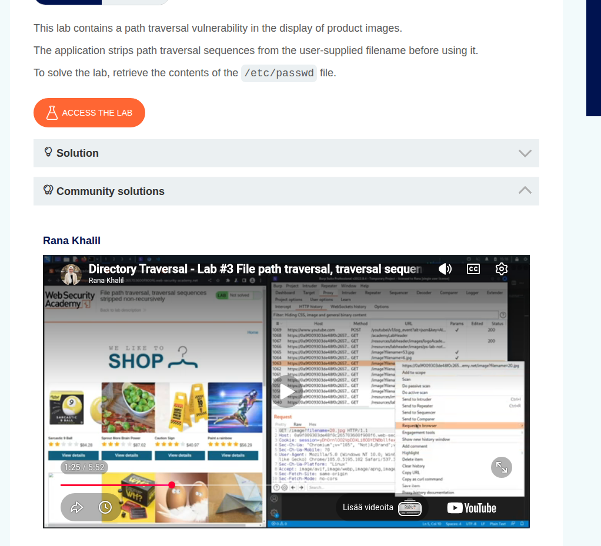

Eli community solutions: https://www.youtube.com/watch?v=_6ADm32rENs

Katsoin ratkaisun myös ihan nettisivuilta suoraan:

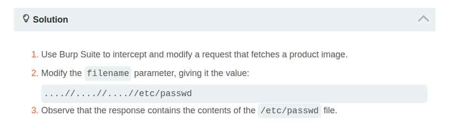

Mielenkiintoinen ratkaisu! En kuitenkaan ymmärtänyt, miksi tämä ratkaisu toimii.

>- Insecure Direct Object Reference (IDOR)
>- - i) Insecure direct object references
https://portswigger.net/web-security/access-control/lab-insecure-direct-object-references

Tätä en saanut myöskään tehtyä, esim. path traversal kuvissa ei toiminut.

katsoin youtube videon: https://www.youtube.com/watch?v=jgbHaALms_Q

Eli siis ratkaisu löytyi "chat" valikosta, sieltä pystyy lataamaan transcriptin.

Zap:issa download-transcript url:in voi muuttaa ja lataa myös edellisiä transcriptejä (tai siis voi katsoa myös selaimen network valikosta myös)

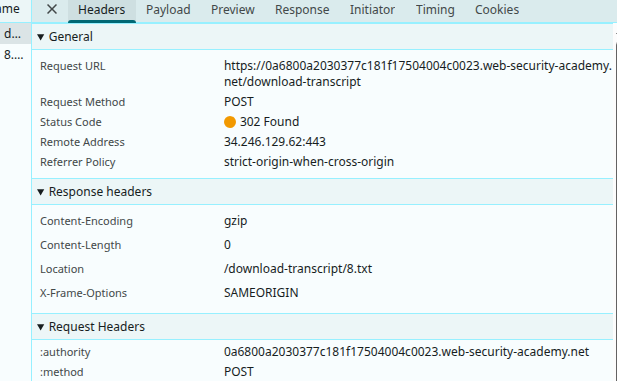

Kuten tästä huomaa on ladattu 8.txt

mutta post requestin voi muuuttaa ja voi hakea 0.txt tiedoston (niinkuin videossa kerrottiin):

Kokeillaan itsekin samaa

Yhdistetään openssl clientillä

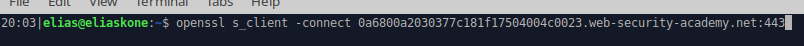

saadaan sertifikaatti dataa

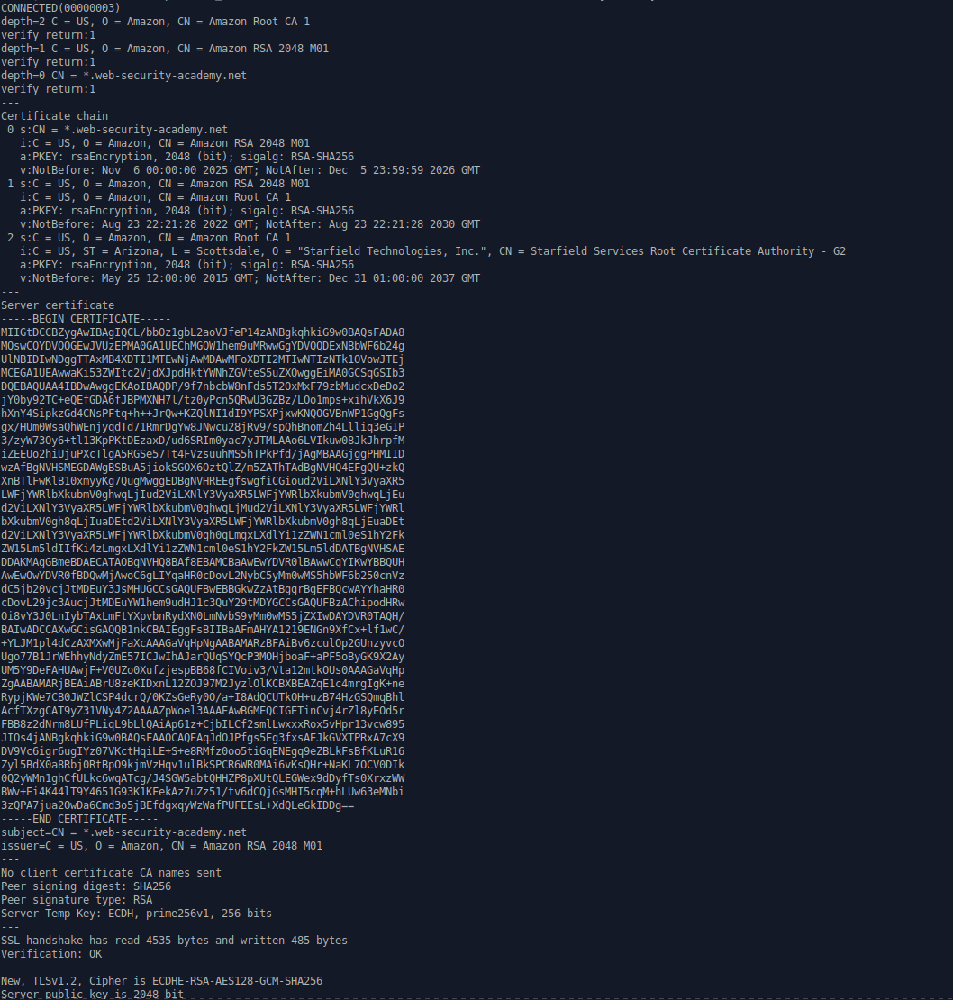

Tarkistin miten tehdään HTTP request:
https://www.cloud4y.ru/en/blog/what-are-http-requests/

Valmistellaan HTTP request:

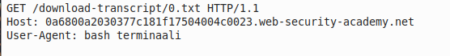

Ei toiminut :(

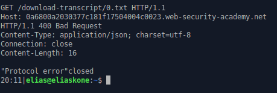

Kokeilin vielä curlilla eli valikosta copy as curl:

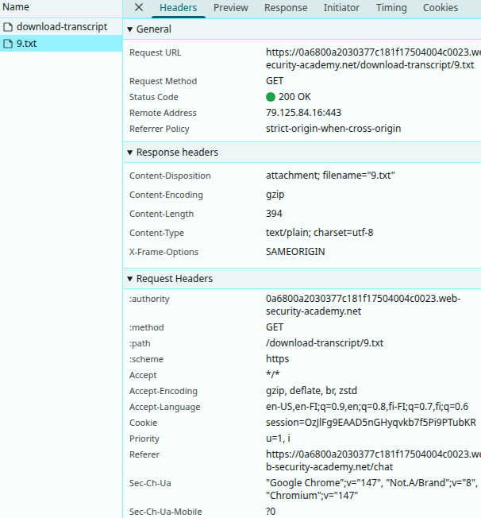

Toimii!:

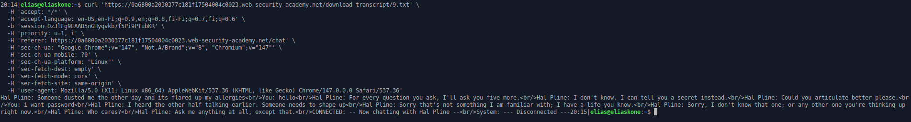

muokkasin tätä vähän:

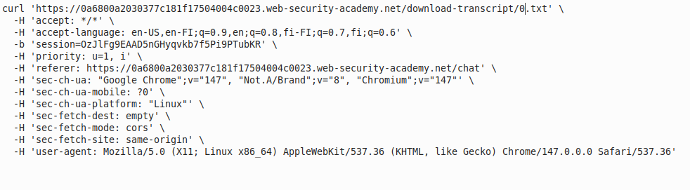'

Eli haetaankin 0.txt

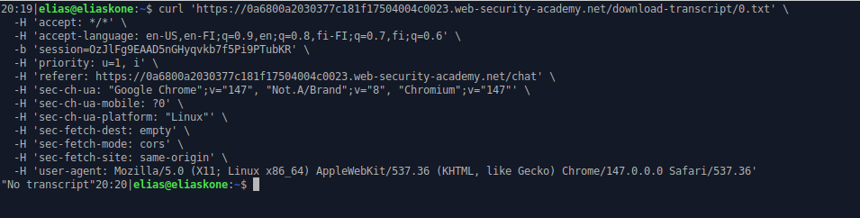

Kokeillaan 1.txt

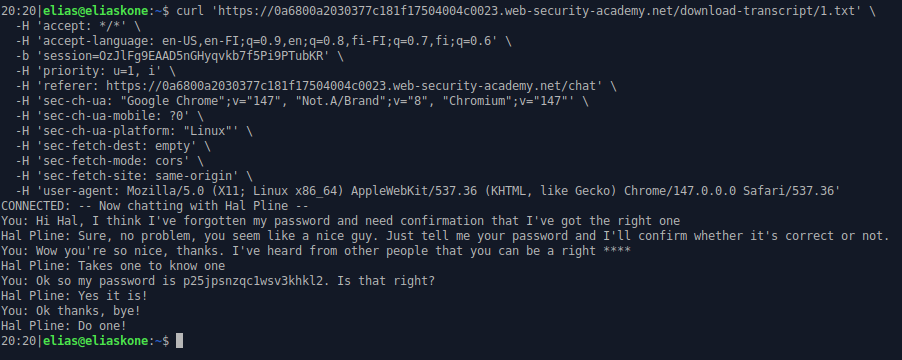

Salasana löydetty videon avulla!