# h5 Fuzzy
## tehtävät: https://terokarvinen.com/tunkeutumistestaus/#h5-fuzzy

>Opit käyttämään maailman johtavaa weppifuzzeria: ffuf.

>x) Lue/katso/kuuntele ja tiivistä. (Tässä x-alakohdassa ei tarvitse tehdä testejä tietokoneella, vain lukeminen tai kuunteleminen ja tiivistelmä riittää. Tiivistämiseen riittää muutama ranskalainen viiva. Lisää mukaan jokin oma idea, huomio, kysymys tai kommentti.)

>- Karvinen 2023: Find Hidden Web Directories - Fuzz URLs with ffuf https://terokarvinen.com/2023/fuzz-urls-find-hidden-directories/

- Sivulla kerrrotaan, miten fuff työkalua voi käyttää tiedostojen ja kansioiden etsimiseen.
- ffuf komentoon määritellään sanalista joka sisältää osoitteita esim. .git wp-admin/ jne.
- tiedoston tai kansion löytymisen voi päätellä http status koodista. esim. 404, 200 jne.

> - Jompi kumpi, Hoikkalan video tai teksti:
> - Hoikkala 2023: ffuf README.md https://github.com/ffuf/ffuf/blob/master/README.md , tai
>- Hoikkala "joohoi" 2020: Still Fuzzing Faster (U fool) https://www.youtube.com/watch?v=mbmsT3AhwWU . In HelSec Virtual meetup #1. (Noin tunnin mittainen)

valitsin tekstin.
- ffuf:ia voi käyttää komennolla ffuf -w /path/to/wordlist -u https://target/FUZZ
- - jossa -w on wordlist tiedoston path
- - jossa -u on nettisivun osoite'
- - -fs flagillä voi filteröidä kaikki vastaukset joiden pituus on tasan esim. 4242 merkkiä. Silloin saa tietää sivut jotka palauttavat eri määrän merkkejä
- - -fc flägillä voi filtteröidä kaikki vastaukset joiden response on esim. 404 tms.

>a) Fuzzzz. Ratkaise dirfuz-1 artikkelista Karvinen 2023: Find Hidden Web Directories - Fuzz URLs with ffuf. https://terokarvinen.com/2023/fuzz-urls-find-hidden-directories/

Tämän olin ratkaissut aiemmin "sovellusten häkkeröinti" kurssilla.

https://eliasjungman.github.io/hakkerointikurssi/h2/h2.html

Katso kohta c)

>b) Fuff me. Asenna FuffMe-harjoitusmaali. Karvinen 2023: Fuffme - Install Web Fuzzing Target on Debian https://terokarvinen.com/2023/fuffme-web-fuzzing-target-debian

Ajetut komennot löytyvät Teron ohjeesta

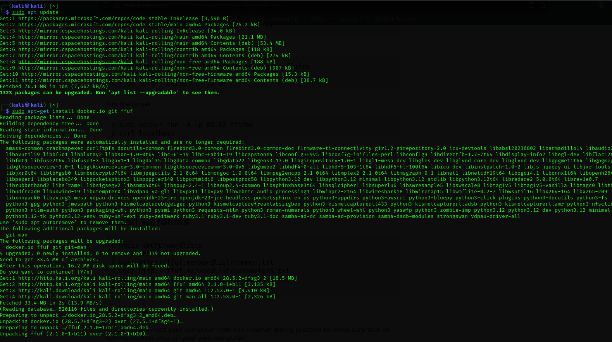

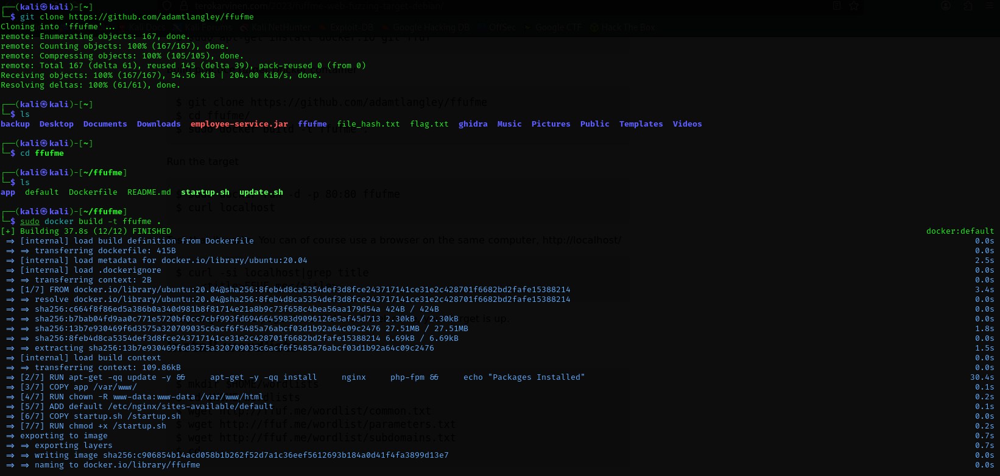

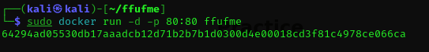

Kokeilin curl localhost. Toimii!

Asennetaan vielä wordlist Teron ohjeiden mukaan:

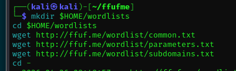

>Ratkaise ffufme harjoitukset - kaikki paitsi ei "Content Discovery - Pipes".

>- c) Basic Content Discovery
>- d) Content Discovery With Recursion
>- e) Content Discovery With File Extensions

Näitä content discovery tehtäviä ei tarvitse tehdä.

>- f) No 404 Status
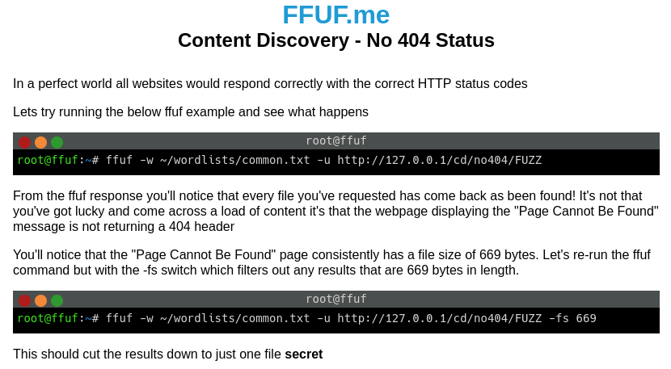

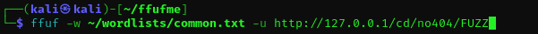

Kaikki on 669 merkkiä kooltaan ja kaikkien status on 200:

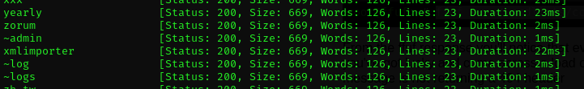

(siis tää on ihan tyhmästi tehty web palvelin, miks server palauttaa 200, jos jotain ei löydy. Pitäisi palauttaa 404 not found)

Kuten tehtävänannossa sanotaan, voidaan käyttää -fs 669, niin saadaan 669 merkkiset suodatettua pois:

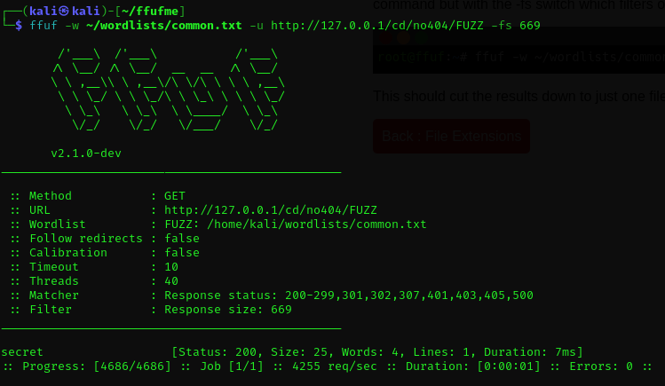

Secret löytyi!

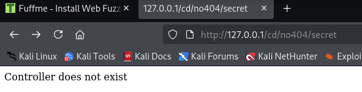

>- g) Param Mining
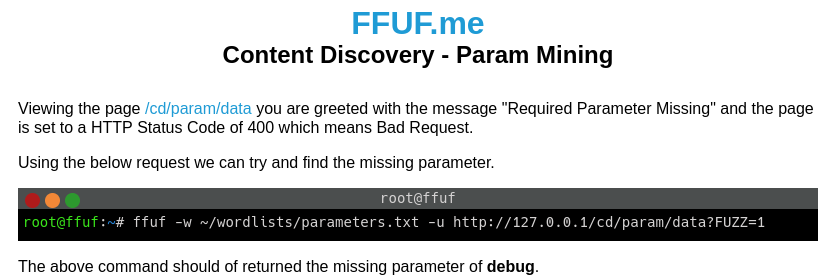

Toi /param/data path voidaan löytää käyttämällä -fs tai -fc flagiä, mutta tehtävänannossa tämä oli jo löydetty.

Mennään sivulle:
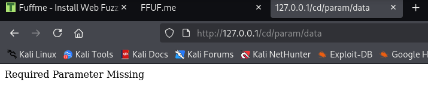

Eli siis tehtävänannon mukaan voidaan käyttää ?FUZZ=1 niin löydetään se missing param ja asetetaan se 1

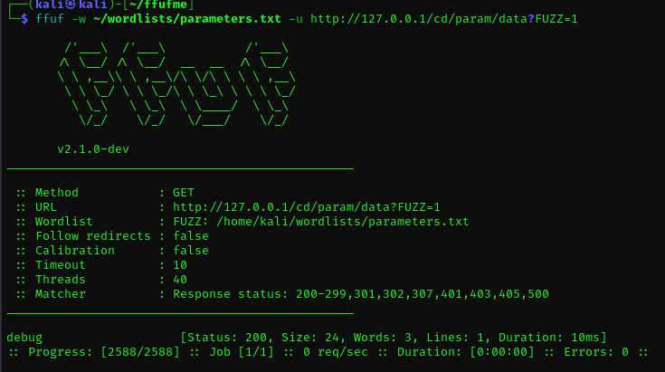

Found! :
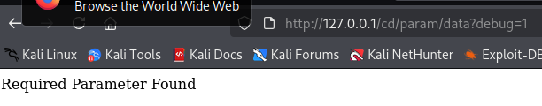

>- h) Rate Limited
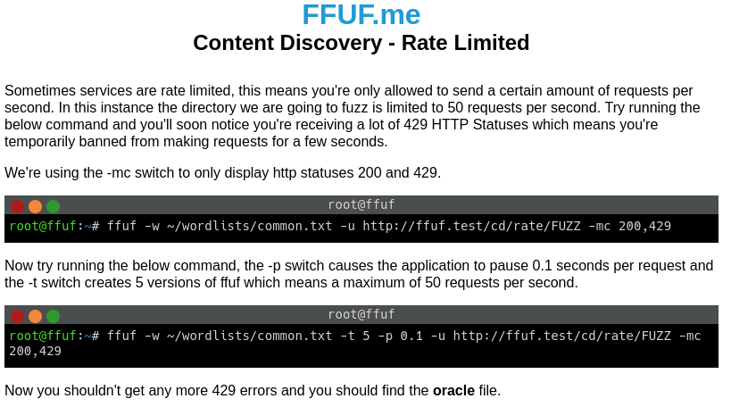

Eli siis serverillä on rate limit. Voidaan ohittaa tämä tehtävänannon mukaan käyttämällä -p 0.1 eli odota 0.1 sekuntia. ja käyttämällä -t 5 eli rajoitus max 50 requestia per sekunti

Kestääpä pitkään...

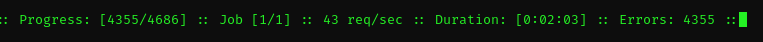

Ei toiminut, en tiedä miksi. Tehtävänannossa oletettu tulos oli että pitäisi tulla oracle tiedosto vastaan:
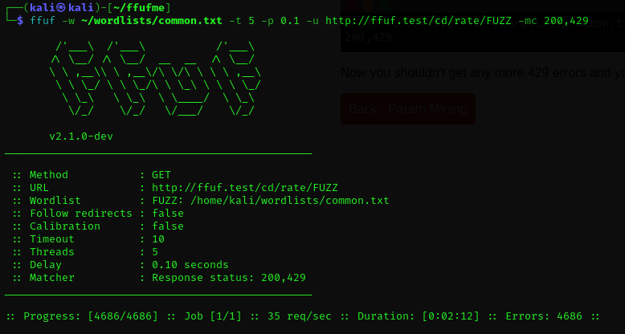

>- i) Subdomains - Virtual Host Enumeration
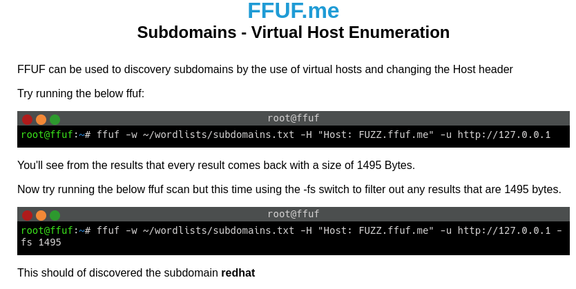

Ffufia voidaan käyttää myös alidomainien etsintään:

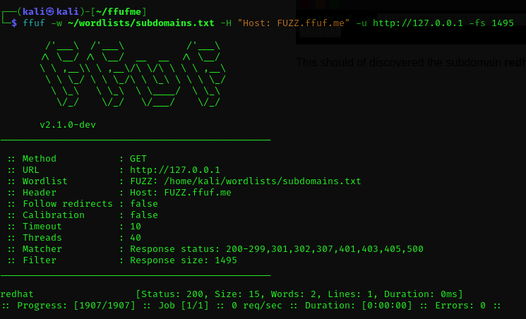