# h7 Toukokuu2026!
## Tehtävät: https://terokarvinen.com/tunkeutumistestaus/#h7-toukokuu2026

>Nyt levitään! Opit murtamaan salasanoja. Huomaa myös h8 bonus.

>x) Lue/katso ja tiivistä. (Tässä x-alakohdassa ei tarvitse tehdä testejä tietokoneella, vain lukeminen tai kuunteleminen ja tiivistelmä riittää. Tiivistämiseen riittää muutama ranskalainen viiva kustakin artikkelista. Kannattaa lisätä myös jokin oma ajatus, idea, huomio tai kysymys.)
>- Karvinen 2022: Cracking Passwords with Hashcat (https://terokarvinen.com/2022/cracking-passwords-with-hashcat/)

Hashcat ohjelmalla voi murtaa salasanan tiivisteitä.

Hashcat yrittää murtaa bruteforcella salasanan wordlist sanojen avulla kokeilemalla jokaista listasta löytyvää merkkijonoa.

Ohjeessa käytetyssä wordlistassa rockyou.txt löytyy Teron artikkelin mukaan 14 miljoonaa sanaa

>- Karvinen 2023: Crack File Password With John (https://terokarvinen.com/2023/crack-file-password-with-john/)

Ohjeessa kerrotaan, miten muurretaan zip tiedoston salasana käyttämällä apuna John työkalua.

Ensin zip2john komennolla otetaan talteen zip tiedoston tiiviste (hash)

Jonka jälkeen yritetään murtaa tiiviste sanakirjahyökkäyksellä.

Ohjeessa kerrotaan, että john työkalua voi käyttää myös muiden tiedostojen murtamiseen esim.:
- keepass
- signal
- telegram
- ssh
- openssl

>- Vapaaehtoinen: € Santos et al 2017: Security Penetration Testing - The Art of Hacking Series LiveLessons: Lesson 6: Hacking User Credentials (8 videos, about 30 min) (https://learning.oreilly.com/videos/security-penetration-testing/9780134833989/9780134833989-sptt_00_06_00_00)

>a) Asenna Hashcat ja testaa sen toiminta murtamalla esimerkkisalasana.

Käytän kali linuxia virtualboxin kautta, joten hashcat oli jo valmiiksi asennettu:

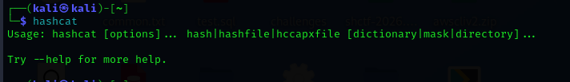

Testataan esimerkkisalasanaa. Teen uuden salasanan ja palautan salasanan sha256 tiivisteen. Esimerkkinä kokeilen 123455 salasanaa:

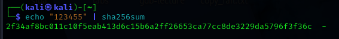

Sitten murtamaan, käytetään apuna Teron hashcat ohjetta:

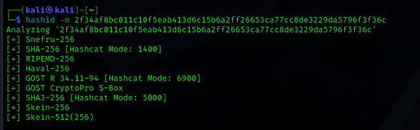

hashid arvelee olevan hashin joku näistä. Valitaan "[+] SHA-256 [Hashcat Mode: 1400]" eli hashcat -m 1400

Kokeillaan Teron ohjeen mukaan tätä hashcattia:

Ei toiminut

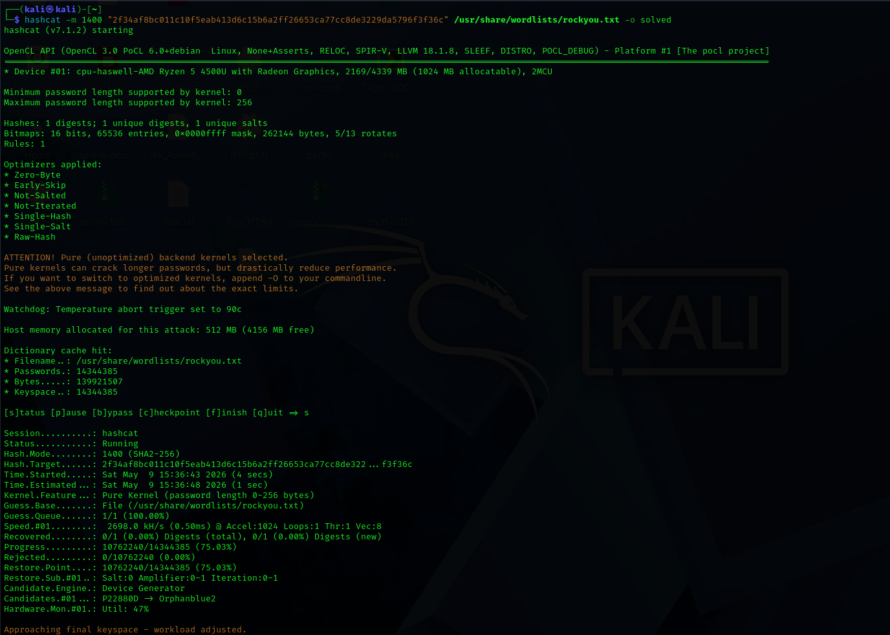

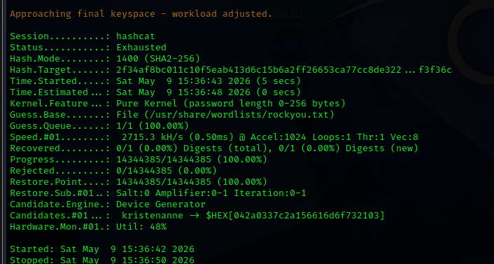

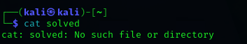

Yritetään uudelleen, mutta md5sum. Lisäksi kokeillaan helpompaa salasanaa "123456"

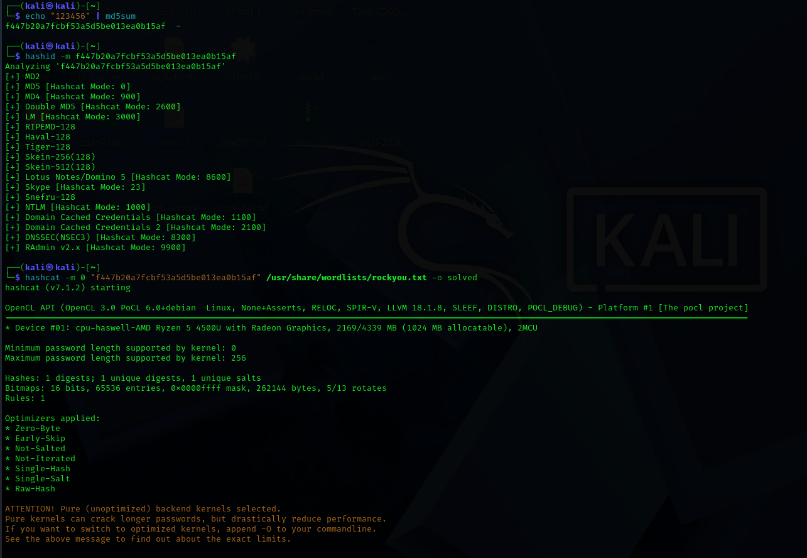

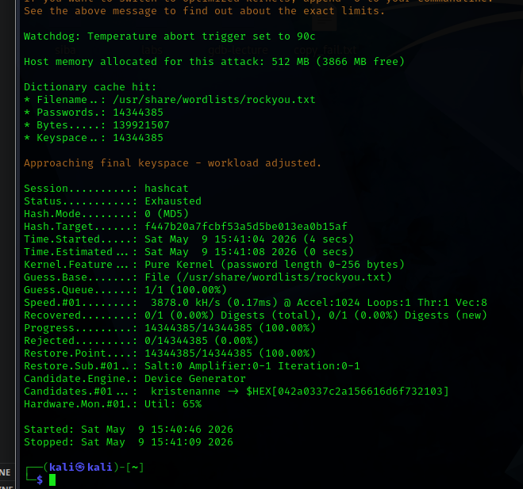

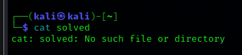

Ei toiminut

Kokeillaan Teron ohjeesta löytyvää komentoa:

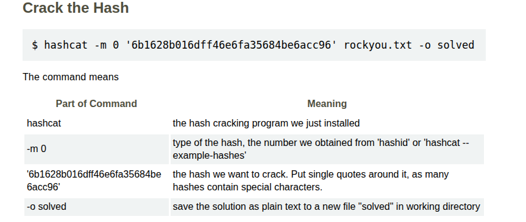

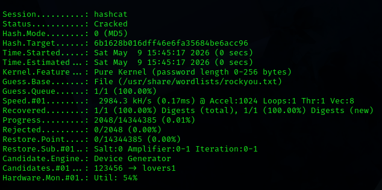

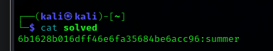

Toimii! Kokeillaan vielä tehdä hash uudelleen.

Käytin apuna hashin tekemisessä pythonilla geeksforgeeksin ohjetta https://www.geeksforgeeks.org/python/md5-hash-python/

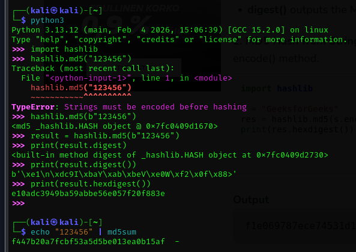

Eri tulokset tulee komennoilla. Muistin äsken, että echo palautta loppuun newline merkin \n. Sen saa pois echo -ne komennolla, muistin komennon ulkomuistista:

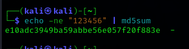

Nyt hash on sama!

Kokeillaan vielä:

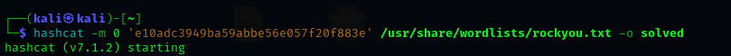

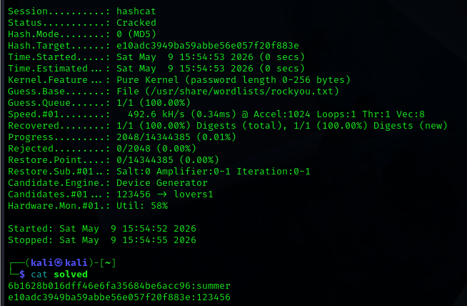

Toimii!

>c) Asenna John the Ripper ja testaa sen toiminta murtamalla jonkin esimerkkitiedoston salasana.

Käytetään esimerkkitiedostona tätä Teron ohjeessa mainittua: https://terokarvinen.com/2023/crack-file-password-with-john/tero.zip

Emme tiedä salasanaa:

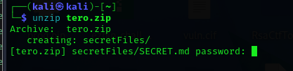

Murretaan se!

Otetaan talteen tiedoston hash:

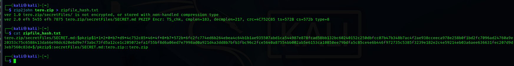

Salasana saatu:

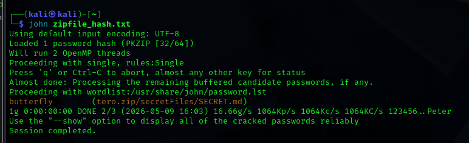

Sitten vaan voidaan avata tiedosto unzipilla!

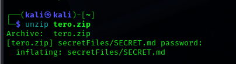

>e) Tiedosto. Tee itse tai etsi verkosta jokin salakirjoitettu tiedosto, jonka saat auki. Murra sen salaus. (Jokin muu formaatti kuin aiemmissa alakohdissa kokeilemasi).

Tehdään itse!

Kysytään tekoäly claudelta miten tehdään salasanasuojattu zip:

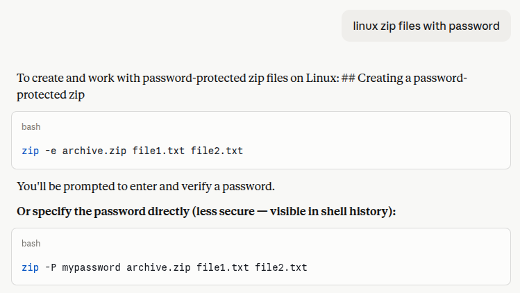

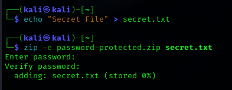

Salasanan murtaminen samalla tavalla:

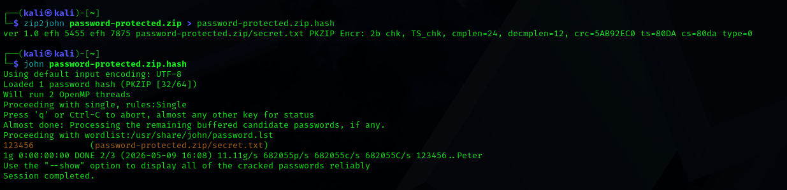

>f) Tiiviste. Tee itse tai etsi verkosta salasanan tiiviste, jonka saat auki. Murra sen salaus. (Jokin muu formaatti kuin aiemmissa alakohdissa kokeilemasi. Voit esim. tehdä käyttäjän Linuxiin ja murtaa sen salasanan.)

Kokeillaan uudelleen sha256 salausta, jota yritin a kohdassa, mutta joka ei toiminut.

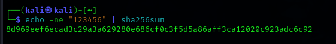

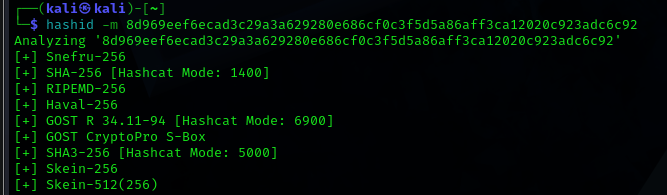

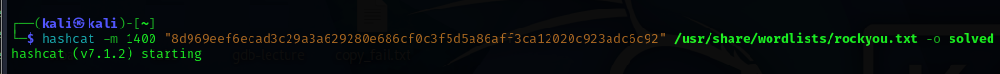

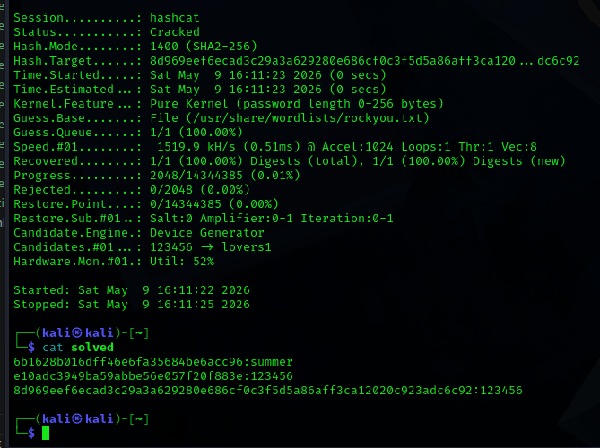

>g) Sanakirja. Oman sanakirjan teko parantaa onnistumismahdollisuuksia. Demonstroi, kuinka teet oman sanakirjan hashcat:n tai john:iin.

Oman sanakirjan voi ladata netistä tai tehdä itse. Olin hashcatissa määritellyt tiedoston /usr/share/wordlists/rockyou.txt joten tämän tiedoston voi vaihtaa toiseksi.

Tässä esimerkki miten voidaan tehdä oma:

cp /usr/share/wordlists/rockyou.txt /usr/share/wordlists/oma.txt

echo "salainen_salasana" >> /usr/share/wordlists/oma.txt

--> > merkki tallentaa tiedoston alkuun, >> merkki tallentaa tiedoston loppuun

cat komennolla voi vielä varmistaa että kaikki salasanat ovat eri riveillä

>h) Hash rules. Näytä esimerkki HashCatin sääntöjen käytöstä (rules).

Katsotaan hashcatin dokumentaatiosta:
https://hashcat.net/wiki/doku.php?id=rule_based_attack

Kokeillaan sääntöä, joka muuttaa kaikki salasanat isoiksi kirjaimiksi Kysytään apua tekoälyltä:

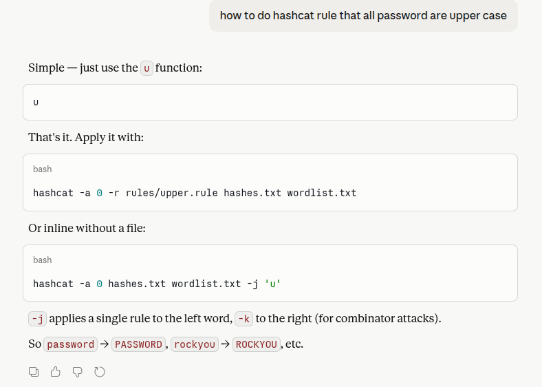

Hashcatin dokumentaatiossa kerrotaan, että sääntöä voi testata näin:

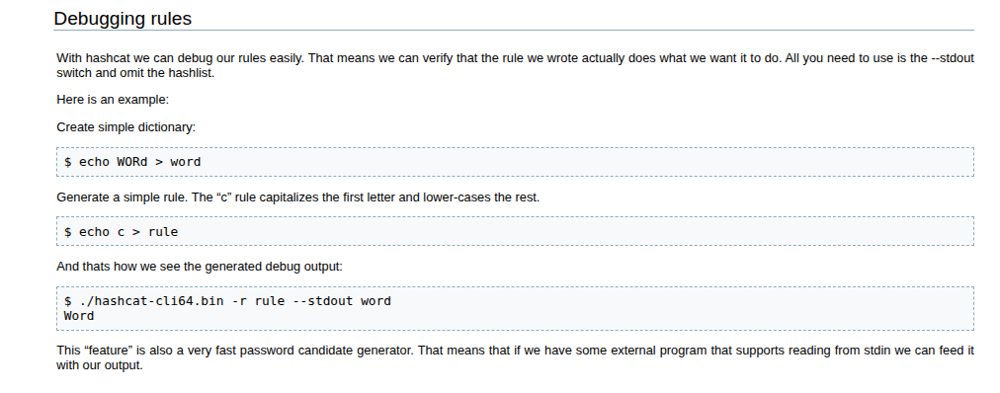

Ei toiminut:

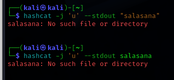

Tämä johtuu siitä, että tiedostoa salasana ei löytynyt.

Lisäksi -j käytetään jos kyseessä on wordlist:

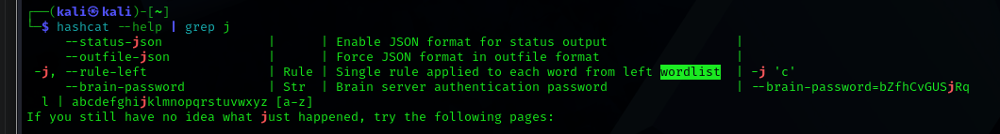

Nyt kun ei ole wordlistaa, pitää tallentaa tiedostoon. Mennään hashcation dokumentaatiosta löytyvän ohjeen mukaan:

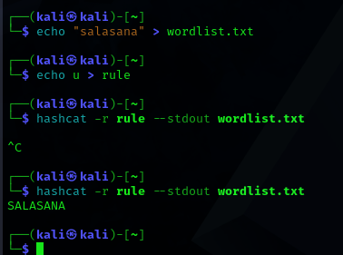

Eli nyt hashcat muuttaa kaikki wordlistista löytyvät sanat niin, että ne sopivat annettuun sääntöön.

>i) Lippuvalmistelu. Valmistele kone ensi viikon lipunryöstöön. Tästä kohdasta ei tarvita kattavaa raporttia, riittää pelkkä luettelo siitä, miten ratkaisit allaolevat kysymykset. Jos sinulla on esimerkiksi valmis, toimiva Kali VM tavallisella PC:llä, tässä ei tarvitse tehdä juuri mitään.
>- amd64. Haasteet voivat sisältää amd64-binäärejä. Nämä toimivat itsestään perus-PC:ssä, joita lähes kaikkien koneet ovat. Macintosheissa (M1, M2, M3...) hankala tehdä tehtävää, joten kannattaa ottaa tavallinen amd64-kone.

Muistaakseni minulla on amd prosessori läppärissäni

>- Netti. Koneesta pitää päästä nettiin, jotta voit palauttaa liput. Voi olla kätevää, että saat nettiyhteyden katkaistuksi, jotta porttiskannailu ym. on huoletonta.

Käytän vm. Saan netin katkaistua halutessani vm ympäristöstä.

>- Too many secrets. Opettaja voi tarkastaa lipunryöstön koneesi ja tutkia kaikkia siellä olevia tiedostoja. Jos käytät pelkästään virtuaalikonetta (myös selailu, muistiinpanot ym virtuaalikoneesta), tarkastaminen koskee vain sitä. Katso, ettei tällä koneella ole luottamuksellisia tietoja.
>- Koneella saa olla haluamasi ohjelmat ja työkalut. Työkaluista ja ohjelmista pitää antaa opettajalle kopio, jos ne eivät ole yleisesti käytettyjä, tunnettuja ja saatavilla olevia vapaita ohjelmia.
>- Jos lipunryöstön koneella on muistiinpanoja, niistä on annettava kopio opettajalle sähköpostilla. Omia muistiinpanoja saa olla, mutta ei ole pakko. Lipunryöstössä saa lukea julkisia lähteitä, kuten opettajan kotisivuja sekä omia ja toisten julkisia raportteja.
>- Paikallinen tekoäly. Omaa tekoälyä ei tarvita lipunryöstössä, eikä siitä todennäköisesti ole juuri hyötyä. Mutta siltä varalta, että joku miettii tätä: Paikallisen tekoälyn käyttö lipunryöstössä on sallittu, jos ilmoittaa Terolle etukäteen sähköpostilla siitä, antaa opettajalle sähköpostitse täydellisen kopion keskustelusta tekoälyn kanssa ja kaikki paramaterit, sekä kopion tekoälyn koodista ja painoista tai linkin niihin. Ulkopuolisen tekoälyn käyttö verkon yli on lipunryöstössä kielletty.

## Lähteet:

- Tekoäly claude

https://terokarvinen.com/tunkeutumistestaus/#h7-toukokuu2026

https://terokarvinen.com/2022/cracking-passwords-with-hashcat/

https://terokarvinen.com/2023/crack-file-password-with-john/

https://www.geeksforgeeks.org/python/md5-hash-python/

https://terokarvinen.com/2023/crack-file-password-with-john/tero.zip

https://hashcat.net/wiki/doku.php?id=rule_based_attack